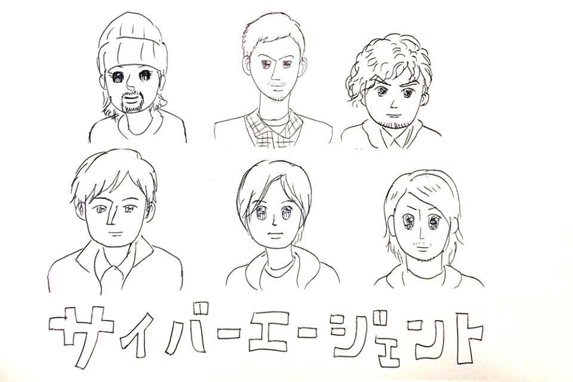
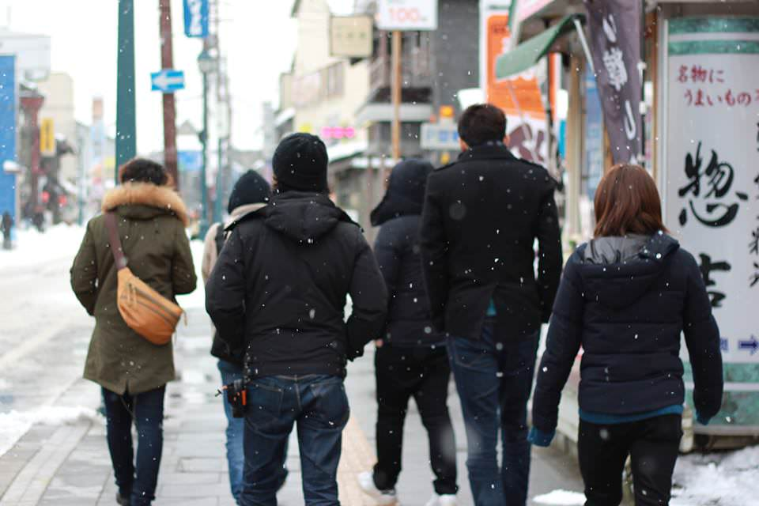

人生初の北海道でした。新千歳空港降りた瞬間に「あ、これはヤバイかも」と思うほど寒かった。でも聞いていたとおり室内とかは暖かくて、とても過ごしやすい。

## Simuraiに会ったよ

そう、あの世界のUI/UX Designer、[@simurai](http://simurai.com/)氏にお会いしてきた。[BonBon Button](http://archive.simurai.com/lab/buttons/)あたりが有名だろうか。氏が札幌にいるということは知ってたので、誘ってみようということで@hilokiさんが誘ったら来てくれた。

<blockquote class="twitter-tweet" lang="ja">
<a href="https://twitter.com/hiloki">@hiloki</a> Is it <a href="http://t.co/Ueod5YFkwX">http://t.co/Ueod5YFkwX</a>? I won’t understand much since my Japanese is not that good. But sure, I’ll come anyways. ;-)
&mdash; simurai (@simurai) <a href="https://twitter.com/simurai/statuses/402398182136479744">2013, 11月 18</a></blockquote>

セッション後の懇親会にも来てくれて、話もしてきた（英語喋れないけど、片言でなんとか）。すごい気さくでいい人だった。

<blockquote class="twitter-tweet" lang="ja">
<a href="https://twitter.com/1000ch">@1000ch</a> <a href="https://twitter.com/hiloki">@hiloki</a> <a href="https://twitter.com/pocotan001">@pocotan001</a> Thanks for coming. That was great. Enjoy Otaru.
&mdash; simurai (@simurai) <a href="https://twitter.com/simurai/statuses/409520557915267072">2013, 12月 8</a></blockquote>

## フォローアップ

さて、本題。セッションの後半でのデモで（デモになってなかったけど）HTMLInspector、CSSLint、JSHintのエラーサンプルを解説したが、コードと紐付けて説明が出来ていなかったので、HTMLInspector、CSSLint、JSHintを実際に試すあたりを[1000ch/brushup-sample](http://github.com/1000ch/brushup-sample)に詳しく書いた。

<iframe loading="lazy" class="dropshadow speakerdeck-iframe" src="https://speakerdeck.com/player/1b318f5058b0013149ef66d2f27aad89" title="Brush up your Coding 2013 Winter" allowfullscreen="true" style="aspect-ratio: 560 / 420;" data-ratio="1.3333333333333333"></iframe>

## SaCSSはとても素敵なコミュニティ

滞在期間は2.5日ほどでしたが、かなり濃かった。参加者の皆さん、とても勉強熱心で温かい人達ばかりで、とても楽しかった。また機会があれば是非行きたい。札幌の皆さんありがとうございました！

こちら石山さんよりの頂きものの絵。私は左下。平木さんは左上。何かがおかしい気もするけどよく似てる！

こちら@nakajmgさんより。いい写真！

## 参加者の皆様のブログ（随時更新）

- [SaCSS Special4 Frontrend in Sapporoへ行ってきました。](http://marimelody.net/web/77) by [@marimelody11](https://twitter.com/marimelody11)さん
- [SaCSS Special4 Frontrend in Sapporoに参加してきた](http://nakajmg.github.io/blog/2013-12-11/saccs-frontrend.html) by [@nakajmg](https://twitter.com/nakajmg)さん
- [SaCSS Special4 Frontrend in Sapporo -最新フロントエンド技術アップデート特集- に参加しました！](http://cat-speak.net/2013/12/17/713/) by コモモさん
- [SaCSS Special4 Frontrend in Sapporo に参加しました](http://mamiline.tumblr.com/post/70811693874/sacss-special4-frontrend-in-sapporo) by [mamiline](https://twitter.com/mamiline6)さん
- [SaCSS Special4 Frontrend in Sapporo を開催しました](http://h2ham.net/sacss-special4-frontrend-in-sapporo) by [@h2ham](https://twitter.com/h2ham)さん
