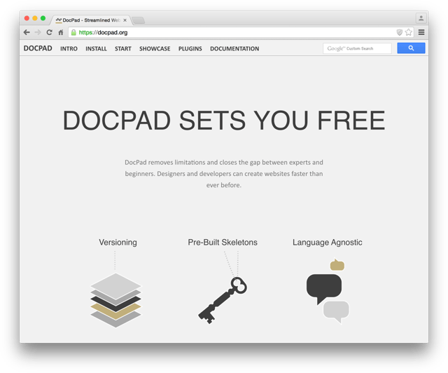

Hugoはじめました。

## DocPadからHugoへ

1000ch.netというドメイン自体は2009年から持っていたけど、技術ブログを書くようになったのは2012年11月から。暫くはJekyll+GitHub Pagesでホストしていたけど、ビルドが重かったり、GitHub Flavored Markdownが使えなかったりの不満を感じて途中でDocPadに移行。

## Jekyll時代

[Jekyll](http://jekyllrb.com/)はRuby製の静的サイトジェネレータ。GitHubの公式サポートが得られるっていうこともあったし、[@cssradar](http://twitter.com/cssradar)氏が[Jekyll | CSS Radar | Little Books For Front End Developers](http://css.studiomohawk.com/jekyll/2011/06/11/jekyll/)という記事を書いていたこともあって、スクラッチで書き始めた。それまでは、なんとなくレベルでWordPressを立てていた。

JekyllはGitHub製というだけでなく、GitHubの`username.github.com`というリポジトリ、もしくはその他リポジトリでも`gh-pages`ブランチであれば、Jekyllのプロジェクトソースをコミットすることで自動でコンパイル・デプロイが行われる。他の静的サイトジェネレータであれば手元でビルドした結果なり、CIサーバーでビルドした結果の静的リソースをそれらのリポジトリにコミットしないとGitHub Pagesとして公開されない。そんなに手間でもないけど、ブランチが汚れないしお手軽である。

移行はしたけど、決してモノが悪いというわけではない。実行速度も改善されてきたという噂もあるし、僕が移行したのは、重さに不満をもったというよりはNode.js製のCMSに変えてみようかなーと、その程度のものだったと思う。

## DocPad時代

[DocPad](https://docpad.org/)はNode.js製のJekyllリプレイスとも言われる静的サイトジェネレータ。巷ではOctpressとかも流行っていたけど、DocPadを選択。Jade・Stylus・RSS出力などなど、いろんな機能がプラガブルに追加できたし、使い勝手もそこそこ良い。ちなみに自分が構築周りをやった[JS Girlsのサイト](http://jsgirls.org)では、DocPadを採用している。

しばらく不満のないブログ生活を送っていたけど、いつの間にかビルド時にDocPadがコマンドラインでプロジェクトに寄付を求めるログを出すようになってきたのと、パーシャル化したり記事が増えるに連れて（DocPadの仕事が増えるに連れて）ビルドに時間がかかるようになってきた。寄付はさておき。ビルド時間の短縮のために、JadeにしていたところをHTMLにしたり、パーシャル化していた部分をマージしたり、地道な工夫を凝らしていたんだけど、システム的な想像をツールに抑止されるのもアレだよなぁとか。

## Hugoにした

[Hugo](http://gohugo.io/)自体はもっと前から知っていた（きっかけはまたもや[@cssradar](http://twitter.com/cssradar)氏なんだけど）けど、まだツールとして成熟していなくてあまり興味が向いていなかったところ、ちょろちょろと「Hugoに移行しました」という記事を見かけるようになった。

- [OctopressからHugoへ移行した](http://deeeet.com/writing/2014/12/25/hugo/) - SOTA
- [Jekyllが許されるのは小学生までだよね](http://t32k.me/mol/log/hugo/) - Mol

仕組み周りを移行する（しかも今回はデザインもそのまま移植する）のは腰の重い作業なんだけど、やってみたらビルドは速いのなんのって。30秒くらいかかっていたビルドが0.1~0.2秒で終わるもんで、最初はバグってるんじゃないかと思ったくらいだ。これを体感してしまうとそこまで重さを感じていなかったDocPadも余計に重さが相対的に気になってくる。

おおよその作業（デザイン移植とコンテンツ作成）は1時間くらいで終わったんだけど、ページングとかRSSの生成みたいな細かいところのデバッグにかなり時間（2時間くらい）を取られた。わからないところを手探りでやるのは、コレに限らず辛い作業だとは思うんだけど、たまにこういうことしないとダメだね。新しい技術を触るのってやっぱ大事なことだと思ったのでした。そして、終わってしまえばかなり快適。[t32k/mol](https://github.com/t32k/mol)に習って、[wercker](https://wercker.com)で`master`にプッシュしたら自動でデプロイされるようにした。

自分は完全移行を目指したから無駄に苦労した部分があるけど、Hugoにもデフォルトでよさ気なテーマがあるのでそれを使えば楽だし、それをちょっとずつカスタマイズするほうが良さそう。英語だけど、[ドキュメントもとても充実している](http://gohugo.io/overview/introduction/)のでオススメ。成果物は[1000ch/1000ch.net](https://github.com/1000ch/1000ch.net)。
