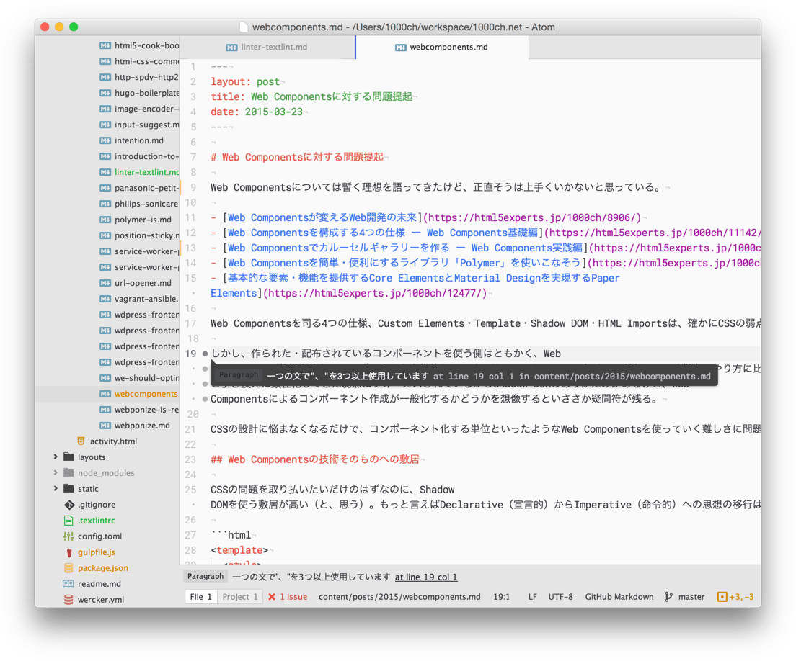

[azu/textlint](https://github.com/azu/textlint)というテキストのlintエンジンがある。Node.js製なのでCLI周りは既にあるが、エディタでもできたら良いなと思って[Atomのプラグインを作った](https://github.com/1000ch/linter-textlint)。TextLintについては「[textlintで日本語の文章をチェックする](http://efcl.info/2015/09/10/introduce-textlint/)」という記事を見てもらえると良い。

## プラグインのインストール

`apm`コマンドでインストール、または **Settings** → **Install** から [**linter-textlint**](https://atom.io/packages/linter-textlint) で検索してもらうと出てくる。

```bash
$ apm install linter-textlint
```

## 使い方

Atomで開くプロジェクトに`.textlintrc`を配置し、プラグインやらオリジナルのルールを配置する。

例えば[textlint-rule-max-ten](https://github.com/azu/textlint-rule-max-ten)という一文に句点を3つ以上入れるなよというルールを使う場合、プロジェクトディレクトリで`npm install [--save] textlint-rule-max-ten`を実行し、`node_modules`配下にルールをインストールする。次に`.textlintrc`を以下のように記述し、`max-ten`ルールを有効にする。

```json
{
  "rules": {
    "max-ten": true
  }
}
```

あとは、マークダウン形式を含めたプレーンテキストを開くだけ。



このようにチェックしてくれる。

## Atomで開いているワークスペースのプラグインをロードする

textlintの基本的な作りとして、

1. textlintが配置されているパスにあるプラグインを自動でロードする
2. textlintコマンドを実行しているパスの`.textlintrc`を読み込んで実施するルールを選ぶ

のようになっている。プロジェクトディレクトリで各種コマンドを実行したり[Gulpのプラグイン](http://github.com/nakajmg/gulp-textlint)を使う場合は、これで何の問題も無いがAtomのプラグインを作ろうとすると

- AtomがバンドルしているNode.jsの実行パス（`/Applications/Atom.app/Contents/Resources/app.asar`）にtextlintを配置する
- Atomで開いているディレクトリにあるプラグインを自動でロードする
- Atomで開いているディレクトリにある`.textlintrc`を自動でロードする

という振る舞いを実装しなければならなそう。IssueやらPull Request投げたらazuさんが光速で対応してくれた。

- [feat(engine): add `TextLintEngine#loadRule` · azu/textlint@b23a91e](https://github.com/azu/textlint/commit/b23a91e8aca3b2caf085faefbf1bd90d22d2f4fe)
- [resolve path with context if passed · azu/textlint@901fabe](https://github.com/azu/textlint/commit/901fabe26158f0ca1fae53d01a8a3695a4a1e68e)
- [setRulesBaseDirectory() and addRule() #23](https://github.com/azu/textlint/pull/23)
