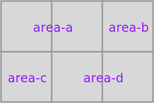
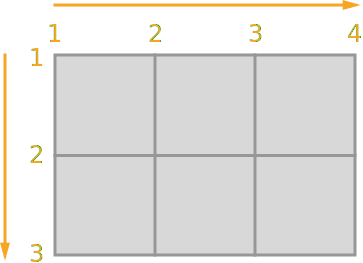
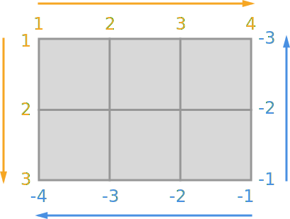

CSSによるレイアウトの問題はFlexboxでほとんどが解決されたと言って良いが、複雑なグリッドレイアウトを実現するために[CSS Grid Layout Module](https://www.w3.org/TR/css3-grid-layout/)の策定が進められている。`display: grid;`ないし`display: inline-grid;`といったように、`display`プロパティに値が追加されており、それらが指定された要素はブロック要素またはインライン要素のように振る舞い、内包されるコンテンツがグリッドモデルに従ってレイアウトされる。

[Chromeは50から、Firefoxは46から対応している](http://caniuse.com/#search=grid)が、Chromeは現安定バージョンの49でも`chrome://flags/`で`Experimental Web Platform features`を有効にすれば使える。

そんな`display: grid;`について調べたメモ。

## 大まかな構造

`display: grid;`によって定義されるグリッド要素と、その子要素として配置されるセルから構成する。例えば、よくあるヘッダー・フッター・メインコンテンツ・サイドカラムがあるページ構造を作るとすると、次のようなHTMLとCSSになる。

```html
<main>
  <header>Header</header>
  <article>Article</article>
  <aside>Aside</aside>
  <footer>Footer</footer>
</main>
```

```css
main {
  display: grid;
  grid-template-rows: 50px 1fr 50px;
  grid-template-columns: 100px 1fr;
}

header {
  grid-row: 1 / 2;
  grid-column: 1 / 3;
}

aside {
  grid-row: 2 / 3;
  grid-column: 1 / 2;
}

article {
  grid-row: 2 / 3;
  grid-column: 2 / 3;
}

footer {
  grid-row: 3 / 4;
  grid-column: 1 / 3;
}
```

<iframe loading="lazy" scrolling="no" title="display: grid;" src="https://codepen.io/1000ch/embed/oxzEBa?theme-id=light&default-tab=html,result" allowtransparency="true" allowfullscreen="true">
  See the Pen <a href='https://codepen.io/1000ch/pen/oxzEBa'>display: grid;</a> by 1000ch
  (<a href='https://codepen.io/1000ch'>@1000ch</a>) on <a href='https://codepen.io'>CodePen</a>.
</iframe>

### レイアウトは子要素の順序に依存しない

見ての通り、グリッド要素下のセル要素の`grid-row`や`grid-column`によってどういった領域を占めるかが決定されるので、HTMLの記述順序は直接影響しない。

### `fr`とはなんぞ

`1fr`という記述があるが、`display: grid;`が指定された要素に対して有効な単位で、要素内の可用領域のうち占める割合を表す。[Flexboxの`flex-grow`](https://developer.mozilla.org/ja/docs/Web/CSS/flex-grow)と同じような振る舞いをすると理解してもらえれば良さそう。

## グリッドを定義する - `grid-template-rows`・`grid-template-columns`

`display: grid;`を指定した要素に、行と列を定義するのが`grid-template-rows`と`grid-template-columns`で、高さおよび横幅をそれぞれスペース区切りで指定する。

```css
.grid {
  display: grid;
  grid-template-rows: 100px 50px;
  grid-template-columns: 100px 150px 50px;
}
```

これで2行×3列のグリッドが定義される。

### セル領域の名前 - `grid-template-areas`

`grid-template-rows`と`grid-template-columns`によってグリッドの格子が定義されるが、生成されたセルにも`grid-template-areas`プロパティで名前を付けることが可能。先程の2行×3列のグリッドのセルにそれぞれ名前をつけると以下のようになる。

```css
.grid {
  display: grid;
  grid-template-rows: 100px 50px;
  grid-template-columns: 100px 150px 50px;
  grid-template-areas: 'area-a area-a area-b'
                       'area-c area-d area-d';
}
```

同じ名前をつけていると1つの領域として扱われる。



### `grid-template-*`のショートハンド - `grid-template`

`grid-template-rows`・`grid-template-columns`・`grid-template-areas`は以下のようにまとめられる。

```css
.grid {
  display: grid;
  grid-template-rows: 100px 50px;
  grid-template-columns: 100px 150px 50px;
  grid-template-areas: 'area-a area-a area-b'
                       'area-c area-d area-d';
}
```

### 区切り線の名前

ここで区切り線と言っているのはグリッドを構成するための上下左右のセル分割線のことで、セルが1つのときは上下に1本ずつ・左右に1本ずつ存在することになる。したがって、先程の2行×3列のグリッドであれば、行には3本・列には4本である。この区切り線の内包するセルの振る舞いを決める上でとても重要である。区切り線は以下のように採番される。



この区切り線には`[name]`のように名前をつけることができる。

```css
.grid {
  display: grid;
  grid-template-rows: [row-a] 100px [row-b] 50px [row-c];
  grid-template-columns: [column-a] 100px [column-b] 150px [column-c] 50px [column-d];
  grid-template-areas: 'area-a area-a area-b'
                       'area-c area-d area-d';
}
```

### セルの暗黙的生成 - `grid-auto-rows`・`grid-auto-columns`

`grid-template`を使うことでセルが明示的に定義されるが、後述の`grid-row`や`grid-column`によって、定義されていないセルを指定された場合にも暗黙的にセルが配置される。その時に、セルの縦横サイズを決定するのが`grid-auto-rows`と`grid-auto-columns`である。

```css
.grid {
  display: grid;
  grid-template-rows: [row-a] 100px [row-b] 50px [row-c];
  grid-template-columns: [column-a] 100px [column-b] 150px [column-c] 50px [column-d];
  grid-template-areas: 'area-a area-a area-b'
                       'area-c area-d area-d';
  grid-auto-rows: 50px;
  grid-auto-columns: 50px;
}
```

### セルの自動配置 - `grid-auto-flow`

後述のセルのレイアウトプロパティによって、位置が決定しないグリッド配下の要素がどのように配置されるかを決定するのが`grid-auto-flow`で、行列を追加して作られた空きセル対して要素を埋めていく。セルが満タンの場合に、行追加を行うのが`row`、列追加を行うのが`column`、空きセルへの配置を試みるのが`dense`。

`dense`の使いドコロが難しそうというか、利用シーンが今のところ浮かばない。

### セル同士の間隔 - `grid-column-gap`・`grid-row-gap`

セル同士の間隔を指定するには、グリッド要素の`grid-column-gap`・`grid-row-gap`プロパティに値を指定する。初期値は`0`になっているのでセル同士は吸着しているが、グリッドそのものにガターを明示するにはこれに任意の値を指定すれば良い。

```css
.grid {
  display: grid;
  grid-template-rows: [row-a] 100px [row-b] 50px [row-c];
  grid-template-columns: [column-a] 100px [column-b] 150px [column-c] 50px [column-d];
  grid-template-areas: 'area-a area-a area-b'
                       'area-c area-d area-d';
  grid-row-gap: 10px;
  grid-column-gap: 20px;
}
```

### `grid-*-gap`のショートハンド - `grid-gap`

`grid-gap`はショートハンドで、`grid-row-gap: 10px; grid-column-gap: 20px;`は`grid-gap: 10px 20px;`と等価になる。

### `grid-*`のショートハンド - `grid`

`grid-template`・`grid-auto-*`・`grid-gap`を一括して指定するには`grid`プロパティを使う。`grid: [grid-template] [grid-auto-flow] [grid-auto-rows] / [grid-auto-columns] [grid-gap];`の順に指定する。

`linear-gradient: ...;`みたいな空気を感じる。

## セルを定義する - `grid-column-start`・`grid-column-end`・`grid-row-start`・`grid-row-end`

分割されたグリッドに要素を配置するには、要素が行列それぞれの **どの区切り線からどの区切り線まで** を占めるかを指定する。要素がセルとして占める範囲を、`grid-row-start`・`grid-row-end`で行方向の区切り線番号を、`grid-column-start`・`grid-column-end`で列方向の区切り線番号を指定する。

```css
.cell {
  grid-row-start: 2;
  grid-column-start: 2;
  grid-row-end: 3;
  grid-column-end: 4;
}
```

これで`.cell`が指定された要素は、コンテナのグリッド要素の **2行目から2行目まで** と **2列目から3列目まで** を占めることになる。

### `grid-*-start`・`grid-*-end`のショートハンド - `grid-row`・`grid-column`・`grid-area`

開始位置と終了位置の指定は、ショートハンドの`grid-row`と`grid-column`を使ってまとめることもできる。まとめる場合は、数値をスラッシュ区切りで指定する。先程の`.cell`をこれらで書き換えると以下のようになる。

```css
.cell {
  grid-row: 2 / 3;
  grid-column: 2 / 4;
}
```

また、開始と終了の4点を指定できればいいので、1度に指定できるように`grid-area`というプロパティも存在する。注意したいのは順序で、`grid-row-start` → `grid-column-start` → `grid-row-end` → `grid-column-end`の順に指定する。先程の`.cell`を`grid-area`で書き換えると以下のようになる。

```css
.cell {
  /* grid-row-start / grid-column-start / grid-row-end / grid-column-end */
  grid-area: 2 / 2 / 3 / 4;
}
```

<iframe loading="lazy" scrolling="no" title="display: grid; positive value" src="https://codepen.io/1000ch/embed/bpeQpa?theme-id=light&default-tab=html,result" allowtransparency="true" allowfullscreen="true">
  See the Pen <a href='https://codepen.io/1000ch/pen/bpeQpa'>display: grid; positive value</a> by 1000ch
  (<a href='https://codepen.io/1000ch'>@1000ch</a>) on <a href='https://codepen.io'>CodePen</a>.
</iframe>

### 区切り線番号のマイナス値

区切り線番号は起点を右下にして、マイナスで指定する方法もある。2行×3列のグリッドであれば、下から数えると-1、-2、-3であり、右から数えると-1、-2、-3、-4ということになる。



```css
.cell {
  grid-row-start: -2;
  grid-column-start: -3;
  grid-row-end: -1;
  grid-column-end: -1;
}
```

<iframe loading="lazy" scrolling="no" title="display: grid; negative value" src="https://codepen.io/1000ch/embed/oxLrrZ?theme-id=light&default-tab=html,result" allowtransparency="true" allowfullscreen="true">
  See the Pen <a href='https://codepen.io/1000ch/pen/oxLrrZ'>display: grid; negative value</a> by 1000ch
  (<a href='https://codepen.io/1000ch'>@1000ch</a>) on <a href='https://codepen.io'>CodePen</a>.
</iframe>

### 命名した区切り線の指定

`### 区切り線とその命名`で`grid-template-rows`と`grid-template-columns`を使って区切り線に名前を付けたが、この名前で範囲を指定することも出来る。

```css
.cell {
  grid-row-start: row-b;
  grid-column-start: column-b;
  grid-row-end: row-c;
  grid-column-end: column-d;
}
```

<iframe loading="lazy" scrolling="no" title="display: grid; named line value" src="https://codepen.io/1000ch/embed/wGWVaQ?theme-id=light&default-tab=html,result" allowtransparency="true" allowfullscreen="true">
  See the Pen <a href='https://codepen.io/1000ch/pen/wGWVaQ'>display: grid; named line value</a> by 1000ch
  (<a href='https://codepen.io/1000ch'>@1000ch</a>) on <a href='https://codepen.io'>CodePen</a>.
</iframe>

### 命名した領域の指定

`### セル領域の命名`で`grid-template-area`を使ってセル領域に名前を付けたが、`grid-area`プロパティにはこの名前を指定することも出来る。

```css
.cell {
  grid-area: area-d;
}
```

<iframe loading="lazy" scrolling="no" title="display: grid; named area value" src="https://codepen.io/1000ch/embed/grMVPj?theme-id=light&default-tab=html,result" allowtransparency="true" allowfullscreen="true">
  See the Pen <a href='https://codepen.io/1000ch/pen/grMVPj'>display: grid; named area value</a> by 1000ch
  (<a href='https://codepen.io/1000ch'>@1000ch</a>) on <a href='https://codepen.io'>CodePen</a>.
</iframe>

### 区切り線からの長さ（スパン）で指定

セル領域は **区切り線から区切り線** による指定だけではなく、距離で指定可能である。昔のテーブルレイアウトの`rowspan`と`colspan`と同じようなものと思って良い。

```css
.cell {
  grid-row: 2 / 3;
  grid-column: 2 / span 2;
}
```

このように`span`キーワードを使って、セルの数を指定可能。もちろんショートハンドプロパティだけでなく、`grid-row-end`プロパティに`span 2`と指定も出来るが、開始点と距離がペアになっている方が一見わかりやすそう。ケースバイケースだけど。

<iframe loading="lazy" scrolling="no" title="display: grid; spanning" src="https://codepen.io/1000ch/embed/dMXxOZ?theme-id=light&default-tab=html,result" allowtransparency="true" allowfullscreen="true">
  See the Pen <a href='https://codepen.io/1000ch/pen/dMXxOZ'>display: grid; spanning</a> by 1000ch
  (<a href='https://codepen.io/1000ch'>@1000ch</a>) on <a href='https://codepen.io'>CodePen</a>.
</iframe>

## グリッド要素における子要素の整列

グリッド要素に対して、[`justify-content`](https://developer.mozilla.org/ja/docs/Web/CSS/justify-content)ないし[`align-content`](https://developer.mozilla.org/ja/docs/Web/CSS/align-content)を使う。Flexboxと同じ要領。

## 親要素に対するセル要素自身の整列

セル要素に対して、[`justify-self`](https://developer.mozilla.org/ja/docs/Web/CSS/justify-self)ないし[`align-self`](https://developer.mozilla.org/ja/docs/Web/CSS/align-self)を使う。こちらもFlexboxと同じ要領。
