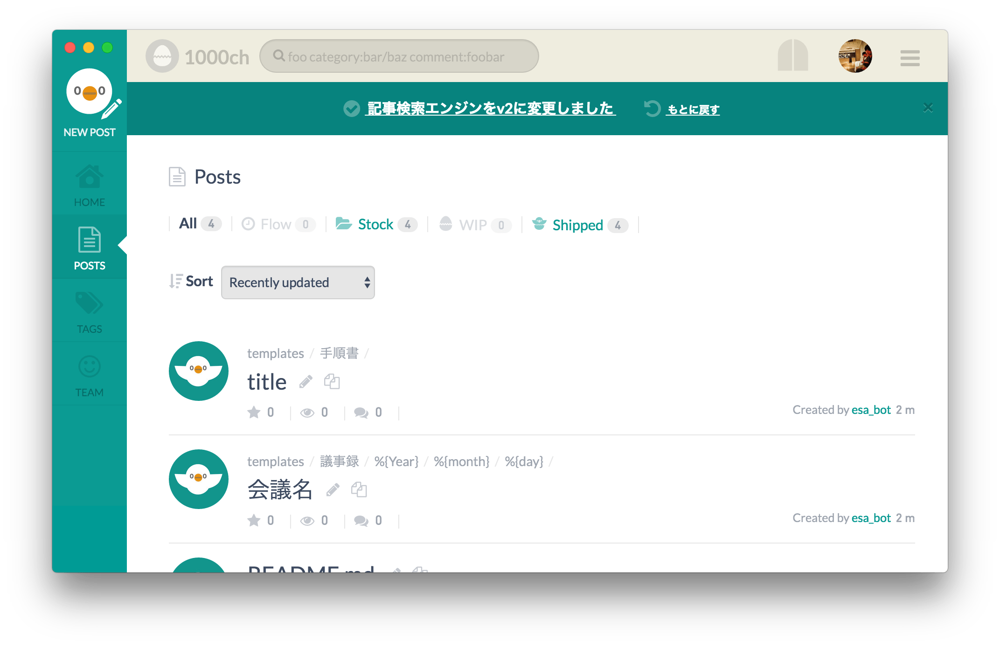

※この記事は [Electron Advent Calendar 2016](http://qiita.com/advent-calendar/2016/electron) 1日目の記事です。

プロジェクトで esa を頻繁に使っているので、 Electron でラップして Dock に常駐できるようにした。鳥から連想して、ウズラを意味する Quail という名前にしてみたが、深い意味はない。



インストールするには [1000ch/quail/releases](https://github.com/1000ch/quail/releases) からアーカイブファイルをダウンロードして、アプリケーションファイルを任意の場所に配置してもらうだけ。

## サードパーティーesaツール

ありがたいことに[サードパーティーesaツール](https://docs.esa.io/posts/158)に載せてもらった。Windows ビルドも用意でき次第、追加してもらおう。

<blockquote class="twitter-tweet" data-lang="ja"><p lang="ja" dir="ltr">【お知らせ】esa 非公式 Mac/Linux app “Quail” by <a href="https://twitter.com/1000ch">@1000ch</a> をサードパーティーesaツールに追加しました ( ⁰⊖⁰) <a href="https://twitter.com/hashtag/%EF%BE%84%EF%BE%89%EF%BD%BA%EF%BE%84?src=hash">#ﾄﾉｺﾄ</a><a href="https://t.co/3H2SQqj6H6">https://t.co/3H2SQqj6H6</a><a href="https://t.co/Ap6RJZESIj">https://t.co/Ap6RJZESIj</a></p>&mdash; esa_io (@esa_io) <a href="https://twitter.com/esa_io/status/802846086972833792">2016年11月27日</a></blockquote>

## 使い手のコンテキストとパフォーマンス

[TrelloをElectronでラップしてアプリにした](/posts/2016/trello-app/)でコンテキストの区別の話をしたが、他にも気づいたことがある。

画面遷移が少ない Trello とは異なり esa では遷移が頻繁に発生する。 esa は SSR だが SPA ではないので2回目以降のナビゲーションでは画面が白くなる時間があるのだが、これが案外気になる。これもコンテキストの話だ。

<blockquote class="twitter-tweet" data-lang="ja"><p lang="ja" dir="ltr">Web アプリを Electron でラップして思うのは「 Dock に常駐するアプリなのに画面真っ白になるのなー」という気持ち。ブラウザだと気にならないのにネイティブアプリにした途端、不思議なくらい気になる。</p>&mdash; 1000ch (@1000ch) <a href="https://twitter.com/1000ch/status/802894791025389575">2016年11月27日</a></blockquote>

これについては次のような安直スクリプトを各ページに仕込んで、主な導線への遷移を高速化しようとしたがダメだった。静的なリソースじゃないとですね。

```javascript
function createPrerender(url) {
  const link = document.createElement('link');
  link.rel = 'prerender';
  link.href = url;
  return link;
}

document.addEventListener('DOMContentLoaded', () => {
  const pathname = location.pathname;
  const head = document.head;
  const baseURL = `${location.protocol}//${location.hostname}`;
  const pathnames = [
    '/posts/new',
    '/',
    '/posts',
    '/tags',
    '/team'
  ];

  pathnames
    .filter(u => u !== pathname)
    .forEach(u => head.appendChild(createPrerender(`${baseURL}${u}`)));
});
```

また Electron でラップすることでオムニボックスが見えなくなるので UI としてスッキリする反面、閲覧ページの URL を参照できない。結果、URL をシェアできない。また esa の URL をクリックしても起動するのは Quail ではなく Chrome なので、 iOS や Android のようなディープリンクの仕組みが macOS にあれば良いなと思いつつ、今後更にブラウザが Appy になっていって、私達が Web をアプリと認識する未来が来るのかどうかに思いを馳せる。
