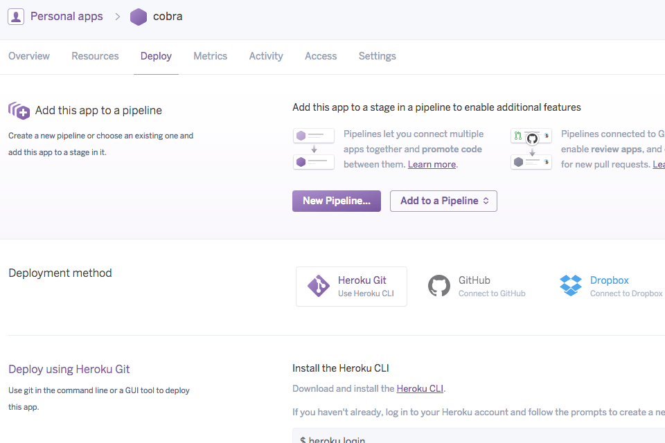
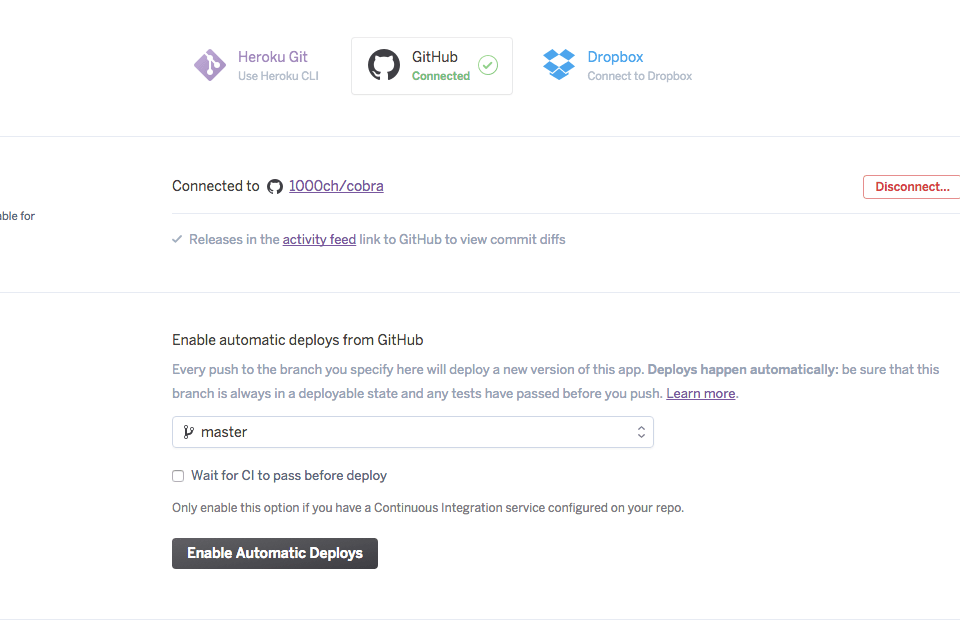

何事も自動が大事という前置きはさておき、GitHub のリポジトリへのコミットを契機に Heroku へ自動でデプロイを行いたい話。機能が存在していることは認識していたが、実際に使ってみたら便利だったのでメモ。といっても、難しいことはないので、詰まることもなかったが。

## Heroku Gitによるデプロイ

Heroku にある Git リポジトリに変更をプッシュすると、それが `Procfile` に沿ってデプロイされる。最も一般的というか基本的？だと思われる。

[1000ch/cobra](https://github.com/1000ch/cobra) というプロジェクトを例に説明する。  Heroku にアプリケーションを作成すると、その名前で Git のリポジトリが作成される。今回は GitHub を `origin` としているので、 Heroku のリモート名を `heroku` とする。

```bash
$ git clone https://github.com/1000ch/cobra.git
$ cd cobra
$ git remote add heroku https://git.heroku.com/cobra.git
$ git push heroku master
```

プッシュすると、それを検知して Heroku 側でデプロイが行われる。

## HerokuとGitHubを連携する

Heroku に GitHub へのアクセス権を与えると、 GitHub リポジトリと Heroku アプリとの連携が可能になる。その後 [Personal Apps](https://dashboard.heroku.com/apps) から対象アプリを選び、 Deploy タブを選択すると Deployment method というデプロイ方法を選ぶセクションが見つかる。



ここで GitHub を選択して、連携したいリポジトリと接続する。すると次のように Automatic deploys のセクションに自動デプロイに関する設定が現れる。



セレクトボックスにはリポジトリのブランチが表示されるので、変更をチェックしてデプロイしたいブランチを選択する。また、Travis CI や CircleCI などの CI によるテストを待った上でデプロイしたい場合はすぐ下にある **Wait for CI to pass before deploy** のチェックボックスにチェックを付ける。あとは **Enable Automatic Deploys** のボタンを押すと設定が有効化される。

手順としては Heroku へのプッシュがなくなっただけではあるが、この一手を省くのがキモ。 「Heroku へのプッシュを自動化する」ことも自動化できそうだが、 GitHub でリポジトリを管理しているのであれば、これが一番正攻法だろう。
