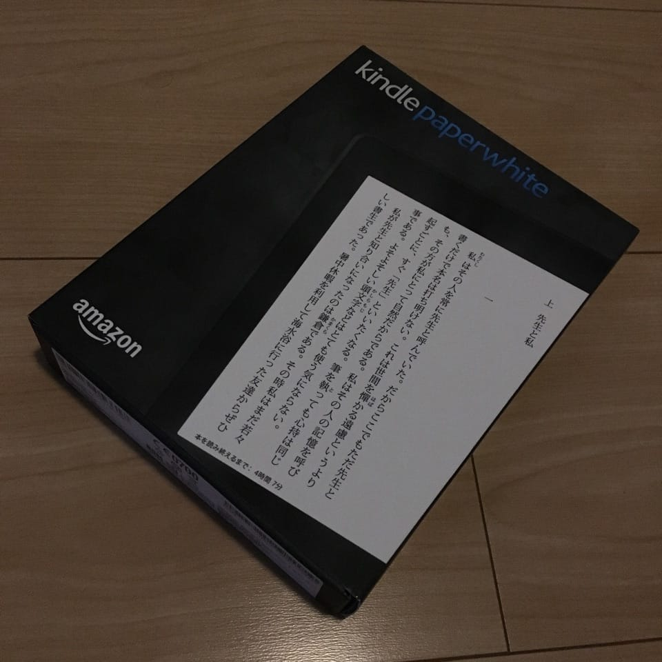
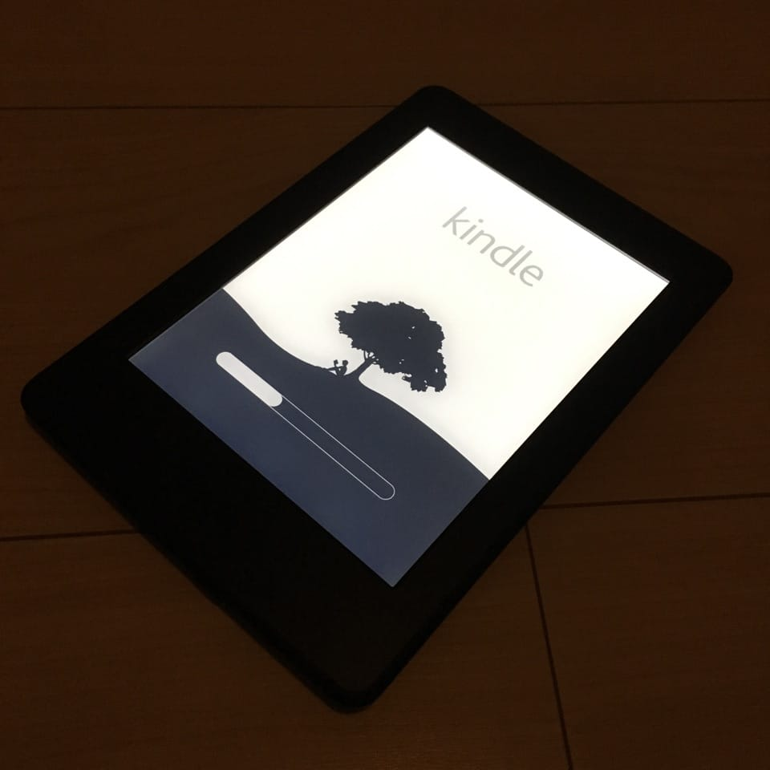

先月に [Kindle Paperwhite](https://www.amazon.co.jp/dp/B00QJDQM9U/?tag=1000ch-22) を購入していた。 [Kindle Oasis](https://www.amazon.co.jp/dp/B010EJWHUC/?tag=1000ch-22) と迷ったが、最終的には両者価格差がアップグレード内容に見合わない気がして Paperwhite を選んだ。 Kindle と Kindle Paperwhite は、時折開催されるプライム会員セールの割引対象になるので、それを狙うのも良い。

## Kindleシリーズのスペック

詳細は[公式ページの比較表](https://www.amazon.co.jp/dp/B00QJDQM9U/?tag=1000ch-22#kindle-compare)を見てもらうとして、どうしても外せない機能は内蔵ライトくらいだった。Paperwhite の内蔵ライトは Oasis に比べてライトの数が少なくて明るさにムラがあるとのことだが、今のところ気になる程度ではない。

解像度は Paperwhite 以降は同じ 300ppi だし、ディスプレイやストレージのサイズも同じ。バッテリーについては Paperwhite が数週間で Oasis が数ヶ月ということで大きく差がありそうだが、主に布団に潜って寝るまでに読む用途で使っており、持ち歩いて使う頻度は少ないので全く気にならない。 Voyage と Oasis にはページ送りの物理ボタンがついており、タッチパネルを指フリックでページ送りするのは少し面倒なので、これは確かに便利そう。重さについては Paperwhite が 205g なのに対して Oasis は 131g （持ち手側の重心）と魅力的である。

## 使った感想と後悔

Oasis を使えば「こちらのほうが良い」と確実になるだろうけど、使っている分には Paperwhite のスペックで不都合はなく満足してしまっているというのが現状である。「どうせ買うなら良いものを」という気持ちで奮発しても良かったけど Paperwhite → Oasis で上乗せされる額が大きいし、それなら PS4 を買うなぁと思いつつ（ [Rebuild: 142: Creative Manager (naoya)](http://rebuild.fm/142/) より ）。

店舗等で実際に両者を比較できなかったのもある。最近 Amazon は店舗での販売をやめたようで家電量販店では順次撤退が進んでいるので、手にとって試す機会は今後もないかもしれない。

<affiliate-link
  src="https://images-na.ssl-images-amazon.com/images/I/618RnCYy2IL._SY355_.jpg"
  href="https://www.amazon.co.jp/dp/B07HCSQ48P/"
  tag="1000ch-22"
  title="Kindle Paperwhite 防水機能搭載 Wi-Fi 8GB 広告つき 電子書籍リーダー">
  読書のための専用端末 - E Ink(イーインク)ディスプレイで、紙のように読みやすい。直接目を照らさないフロントライト方式だから、目に優しく、長時間の読書でも疲れにくい。本数千冊(一般的な書籍の場合)がこの一台に。これまでのKindle Paperwhiteの中で最も薄く、最も軽い。ベゼルがフラットになったモダンなデザイン。300ppiの高解像度で、小さな文字もくっきりキレイ。反射しないディスプレイだから、明るい陽射しの下でもまぶしくない。防水機能搭載(IPX8等級)。ビーチでも、プールでも、お風呂でも快適に読める。長時間バッテリー。一度の充電で数週間利用可能。明るさ調節により、屋外でも室内でも、昼も夜も、快適に読書。700万冊以上の本、マンガ、雑誌、洋書を低価格で。日替わりセールほかお得なタイトルも。プライム会員なら、追加料金なしで対象のタイトルが好きなだけ読み放題(Prime Reading)
</affiliate-link>

<affiliate-link
  src="https://images-na.ssl-images-amazon.com/images/I/616LpttqgUL._SY355_.jpg"
  href="https://www.amazon.co.jp/dp/B07L5GH2YP/"
  tag="1000ch-22"
  title="Kindle Oasis 色調調節ライト搭載 Wi-Fi 8GB 広告つき 電子書籍リーダー">
  Kindle史上最高のPaperwhiteディスプレイ。7インチ、フラットベゼル、300ppi。色調調節ライトを初搭載。ホワイトからアンバーに色の暖かさを調節可能。防水機能搭載(IPX8等級)でお風呂でもプールでも読書を。薄く、軽い、人間工学に基づいたデザイン。ページ送りボタン搭載。本物の紙のような読み心地。最新のe-ink技術採用でページ送りもスラスラ。700万冊以上の本、マンガ、雑誌、洋書を低価格で
</affiliate-link>
