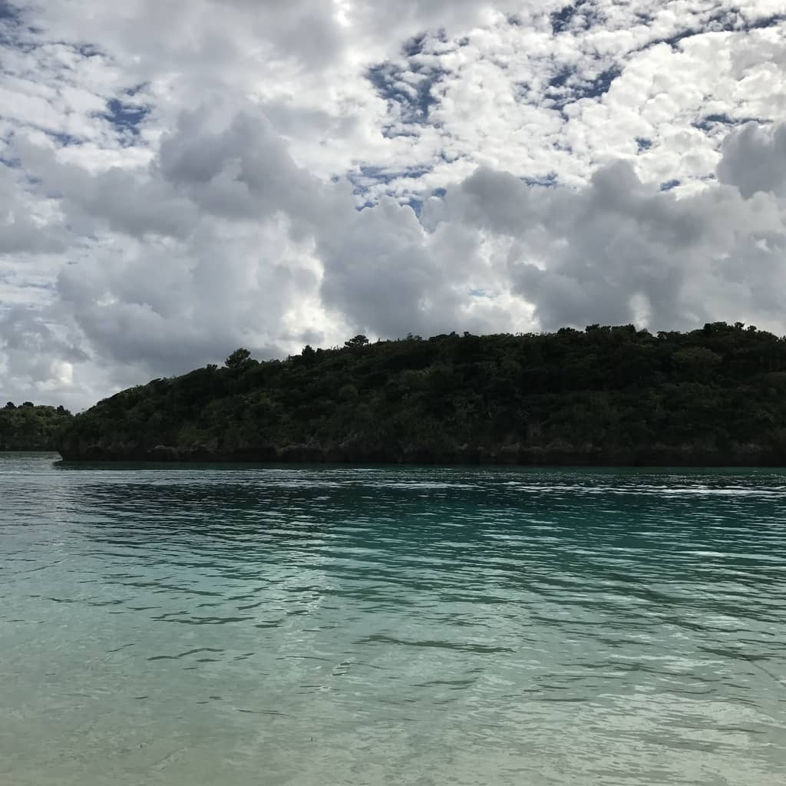
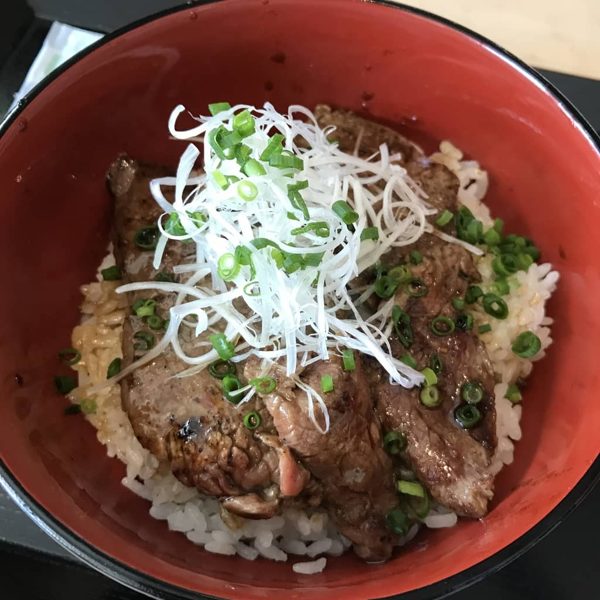

最終日は飛行機の時間もあり、観光に取れた時間は少なかった。

## 川平湾

島の北西にある川平湾でグラスボートに乗ってきた。グラスボートは船の中央部の底が透明になっており、そこから海中の様子を見ることができる。川平湾の海は海の底が見れるくらい綺麗なので、魚・貝・珊瑚といった沖縄の海ならではのものを見れる。

海の色の美しさはココが一番だったと思う。石垣島の観光スポットとして、川平湾は行って損は無さそう。

## 石垣空港

あとは石垣空港でフライトまでの時間を過ごすことにした。

写真は空港内の売店で食べられる石垣牛のステーキ丼970円。あとはお土産を購入したが、今回の旅行で一番金を使ったかもしれない。

## 今回の沖縄旅行のまとめ

アレがアレで飲み歩きが出来なかったが、今回の個人的な収穫としては次の通り。

- **竹富島の西桟橋** には是非行っておきたい
- マリンスポーツは全般的に楽しい（友人談）
- ANA インターコンチネンタルはとても良い
- 羽田・石垣間はやはり直行便が楽である

みなさんお疲れ様でした。

余談だが、最近買った Apple Watch がなかなか活躍してくれた。日本国内であれば Suica が使える所は非常に多いと感じる。
