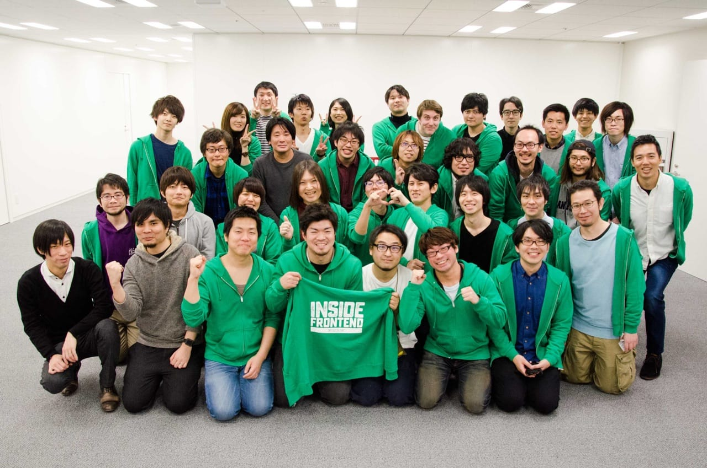

株式会社サイバーエージェント、日本経済新聞社、ヤフー株式会社の三社共催の Web フロントエンドの技術カンファレンス [Inside Frontend](https://inside-frontend.connpass.com/event/47920/) が 2017/2/25 に開催され、スピーカー兼スタッフで参加してきた。

## 発表資料と雑感

技術寄りな話をすることが多いけど、今回は Web クライアントサイドのエンジニアとデザイナーの協業について話した。

<iframe loading="lazy" class="dropshadow speakerdeck-iframe" src="https://speakerdeck.com/player/094bd4bc698d4d5e94c50fa412829ab1" title="Web フロントエンドにおけるコンポーネント化のアプローチ / Component of Web Frontend" allowfullscreen="true" data-ratio="1.7777777777777777"></iframe>

コンポーネント化は、開発や運用のコストを小さくしたり、アプリケーションの品質を高める上で欠かせない。成果物を整理・抽象化したいのはデザイナー・エンジニアを問わず開発者皆が思うところ。でも今までの Web フロントエンドにおけるコンポーネント化したい欲求は、エンジニアの心の中にしかなくて、うまくいってなかった。開発プロセスにおいて、全体像を求められるデザイナーとモジュラーにプログラムを構築していく職能間の意識の齟齬や、Web フロントエンド固有の技術課題である CSS もある。そういった背景がある中で、コンポーネント化を進めるには何に取り組めばいいか、という話をした。

<blockquote class="twitter-tweet" data-lang="ja">
コンポーネント化の話は、やはりデザイナーにもその概念を理解してもらうのが肝なんだな、と。再利用性、保守性、開発コストなど、エンジニアが楽したいからじゃなくメリットがあるんだよという説得材料を示すのが大事、とのこと。<a href="https://twitter.com/hashtag/insideFE?src=hash">#insideFE</a>
&mdash; miyuki (@wtnb) <a href="https://twitter.com/wtnb/status/835473122597838850">2017年2月25日</a></blockquote>

<blockquote class="twitter-tweet" data-lang="ja">
デザイナーにもコンポーネントベースで作ってもらう取り組み。 フロントは分割統治が染み付いているからコンポーネント化は自然に考えることができるがデザイナーはページ全体から考えるゆえに溝が深い。 納得できるが故、辛い現実。 組織の力に頼ることが現実解か。。<a href="https://twitter.com/hashtag/insideFE?src=hash">#insideFE</a> <a href="https://t.co/mopzx5DhRd">https://t.co/mopzx5DhRd</a>
&mdash; dayoshix (@dayoshix) <a href="https://twitter.com/dayoshix/status/835499535904354305">2017年2月25日</a></blockquote>

## AMA (Ask Me Anything)

今回は技術カンファレンスでは初の取り組み [AMA (Ask Me Anything)](https://en.wikipedia.org/wiki/Reddit#IAmA_and_AMA) もあったが、これがとても好評で、Twitterでもアンケートでも非常に良かったとの意見が多かった。

私自身も各ブースを回ったが、[事前公募した質問](https://github.com/insidefrontend/issue1-ama/issues)に加えて会場でも絶えず質問が出ており、とても活発に議論が行われていた。特にヤスヒサさんの「フロントエンドの課題を啓蒙する方法」は圧巻のプレゼンテーションから始まり、私の発表内容でもあったデザイナーとエンジニアの協業に関する話もあり、大変勉強になった。

セッションの方は [Seminar A](https://freshlive.tv/tech-conference/86340) と [Seminar B](https://freshlive.tv/tech-conference/86341) ともに [FRESH!](https://freshlive.tv/) で生配信・アーカイブされているので、当日会場に来れなかった人も楽しめるが、残念ながら AMA の方は映像として記録されていない。参加した人だけのお楽しみと言いたいところだが、公開されないのは勿体無い内容ばかりだった。AMA についても、映像としては残っておらずとも何らかの形でアーカイブしたいとは考えているので、少々お待ち頂ければ。折角 GitHub の issue に質問がリスト化されているので、各位のレスを残せば簡易だが議事録になる（それが最適なアーカイブの形かどうかはさておき）。

<blockquote class="twitter-tweet" data-lang="ja">
<a href="https://twitter.com/hashtag/insideFE?src=hash">#insideFE</a> で良かったのは、セッションの間に30分のAMAを挟んでた所。スピーカーとのコミュニケーションはもちろん、息抜きやネットワーキングの時間に活用できて、下手にセッション詰め込むよりも個人的には実りが多かった。今後の参考にさせて頂きます。
&mdash; Eiji Kitamura (@agektmr) <a href="https://twitter.com/agektmr/status/835491898731053056">2017年2月25日</a></blockquote>

<blockquote class="twitter-tweet" data-lang="ja">
AMAよかった。懇親会でありきたりにピザとビール並べるより有意義だったと思う。 <a href="https://twitter.com/hashtag/insideFE?src=hash">#insideFE</a>
&mdash; okunokentaro (@armorik83) <a href="https://twitter.com/armorik83/status/835493203730051074">2017年2月25日</a></blockquote>

## 感想

会場は Yahoo! 社の新社屋がある東京ガーデンテラス紀尾井町で行われた。会場がすっごく綺麗だったこともそうだけど、会場の設営や当日の運営に際して三社のスタッフさんの協力なしにはこのイベントは当然成し得なかったし、特に Yahoo! 社のスタッフさんにはビルの入退館周りで多大なるご協力をしていただきました。また会場には Yahoo! さんのご厚意でお菓子や珈琲が設置してあり、参加者・スタッフ共々美味しく頂きながらイベントを楽しむことができました。ホスピタリティ半端ない。

<blockquote class="twitter-tweet" data-lang="ja">
Yahoo さんには最初の東京Node学園祭でもお世話になりました。会場的にエレベーターで上がるのに ID が必要だったりするのでかなりの人員が必要なはず。Yahoo 社内から有志が手伝ってくれていたのだと思う。本当にお疲れ様でした <a href="https://twitter.com/hashtag/insideFE?src=hash">#insideFE</a>
&mdash; Kiyoshi Nomo 半泣き黒猫団員 (@kysnm) <a href="https://twitter.com/kysnm/status/835520055664238592">2017年2月25日</a></blockquote>

参加者のみなさん、ありがとうございました。そしてスピーカー・スタッフの皆さん、お疲れ様でした。

私自身は緊張と疲労のせいか途中で若干体調を崩してしまって、ベッドに倒れ込んでそのまま眠って変な時間に起きてこのブログ記事を書いている。たぶん何かしら追記する。。

## 観測したブログ記事など

- [Inside Frontend セミナールーム (A & B) まとめ](https://togetter.com/li/1084960)
- [Inside Frontendに参加しました](https://blog.mismithportfolio.com/web/20170226insidefrontend)
- [Inside Frontend #1に参加してきた](http://rukiadia.hatenablog.jp/entry/2017/02/25/235003)
- [Inside Frontendに行ってきました #insideFE](http://www.chirashiura.com/entry/2017/02/25/225634)
- [Inside Frontend #1 に参加して](http://horicdesign.com/event/inside-frontend.html)
- [Inside Frontend #1に参加したメモ](http://dackdive.hateblo.jp/entry/2017/02/25/180924)
- [Inside Frontend #1に参加しました](http://y-nakahira.hatenablog.com/entry/2017/02/26/225830)
- [InsideFrontEnd 参加レポート1(コンポーネント化って？)](http://takahiro-fujii.hatenablog.com/entry/2017/02/28/222958)
- [InsideFrontEnd 参加レポート2(JsonSchema編)](http://takahiro-fujii.hatenablog.com/entry/2017/03/02/021339)
- [制作者が自分の価値や課題を伝える方法](http://www.yasuhisa.com/could/article/understand-mindset/)
- [Inside Frontend #1 参加レポート #insideFE](http://codenote.net/study/3542.html)
