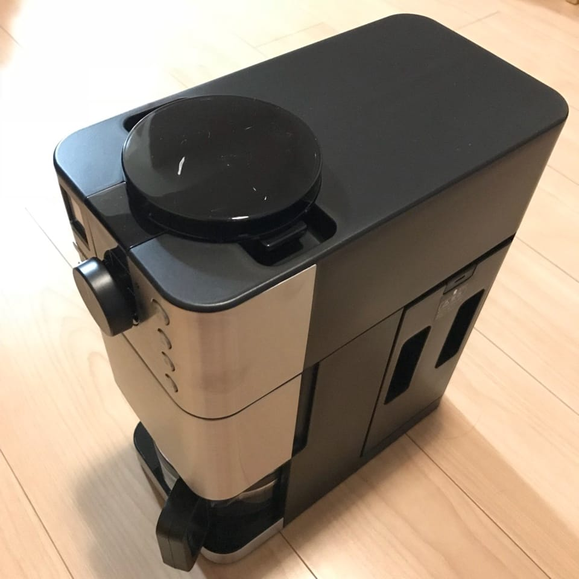
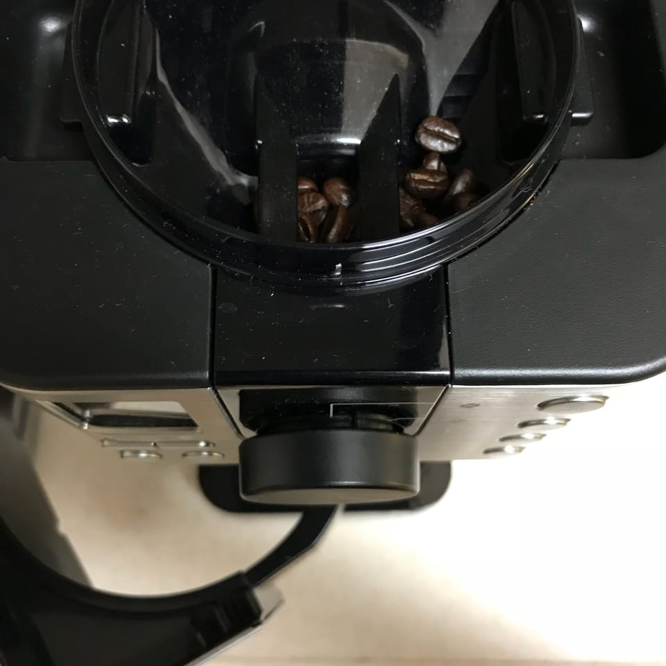
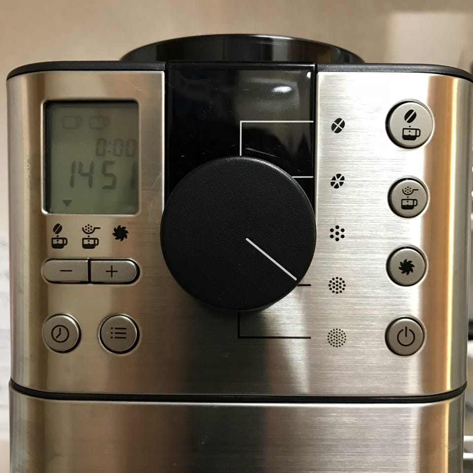
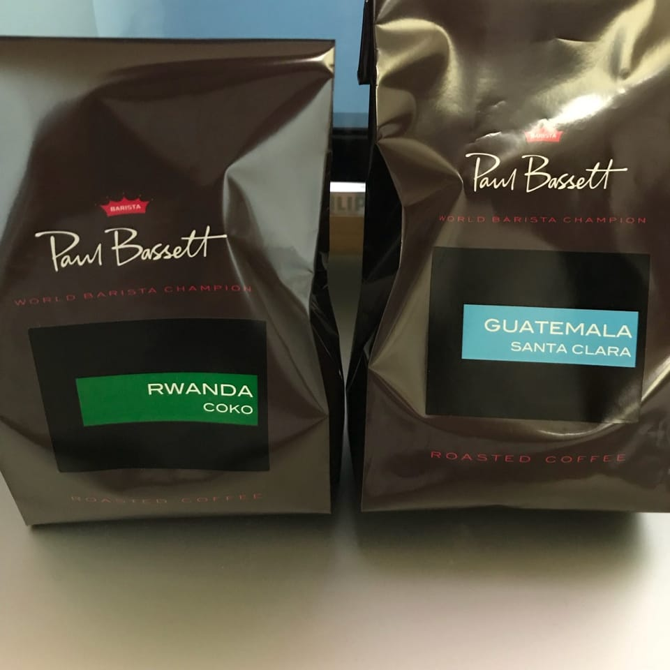

私はコーヒー好きである（詳しいわけではない）。しかし、カフェ等で買って飲む以外の選択肢を取ってこなかった。ミルで挽く、ドリップするという手間が惜しい以前に、台所をほとんど使っていないので、水回りをメンテナンスするのが面倒という理由だ。

しかし各位のコーヒー熱に触発されて機器を揃えてみても良いかなと高まっていたところで、下北沢の無印良品に赴いてみると[豆から挽けるコーヒーメーカー](https://www.muji.net/store/cmdty/detail/4549738398165)の姿があった。結論から言うと買ってしまったわけだが、購入に至ったモチベーションや使っている感想などを綴っていく。

## 豆から挽けるコーヒーメーカーの良いところ

買っても良いと思えた一番の理由は全自動という点である。手動のミルで豆を挽いて、決められた温度のお湯でハンドドリップする楽しみもありそうだが、やっているうちに面倒臭くなる気がしたので、豆を挽いてドリップするところが自動というのは最大のポイントである。

一度に3杯分までドリップできる。備え付けの軽量カップに豆を入れ、杯数分の水を入れ、ロート部分にペーパーフィルタをセットし、あとはボタンで操作するだけでドリップしてくれる。購入前まではペーパーフィルタを都度買うのが面倒な気がしていたが、いざ使い始めてみるとドリップ後のコーヒー豆をペーパーフィルタごと捨てれて楽である。金属網ならランニングコストがより少なく済むかもしれないが、微々たるものだ。

豆を挽くときにダイヤルで粗さを指定できる。粗くすればお湯が豆に触れている時間が短くなるので味が薄くなり、細かくすればお湯が豆に触れている時間が長くなるので濃くなる。同じ豆でもこの設定差で味が結構変わってくるので、好みに合わせると良い。また、上から二番目のボタンであらかじめ挽いてある豆もドリップできる。

タイマーもセット可能で、夜のうちに豆と水を仕込んでおいて朝7:00に☕を飲めるように予約しておくこともできる。ドリップされたコーヒーは下の受け皿に溜まるが、保温機能が付いているので冷めることなく、常に温かいコーヒーを楽しめるようになっている。

手作業じゃないので細かな調節はできない反面、手作業で面倒な部分をおまかせできるのが最大のポイントだろう。

## コーヒー豆を買うのが楽しみになった

今までは凝ったカフェに行ってもコーヒーを飲むだけだったし、豆の専門店に行っても香りを楽しむだけだったが、コーヒーメーカーを手に入れたことで豆を選ぶ楽しみを覚えた。最近だと、渋谷ヒカリエにある [Paul Bassett](https://tabelog.com/tokyo/A1303/A130301/13140156/) に連れて行ってもらって、ルワンダとグアテマラのコーヒー豆を購入した。

コーヒーを飲んでいても酸味や苦味の有無くらいしかまだわからないが、詳しい皆さんに更なるコーヒーのイロハを教わっていきたい。渋谷でオススメのコーヒーショップとか、産地固有の香りや味わい、など。そのうちコーヒーカップやらにも手を出しそうで、若干怖い気もしている。

[Coffee Advent Calendar 2017](https://adventar.org/calendars/2165) 二日目の記事でした。
