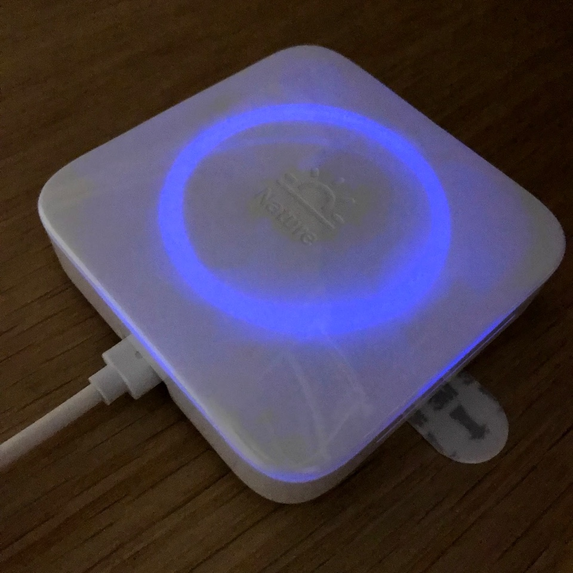
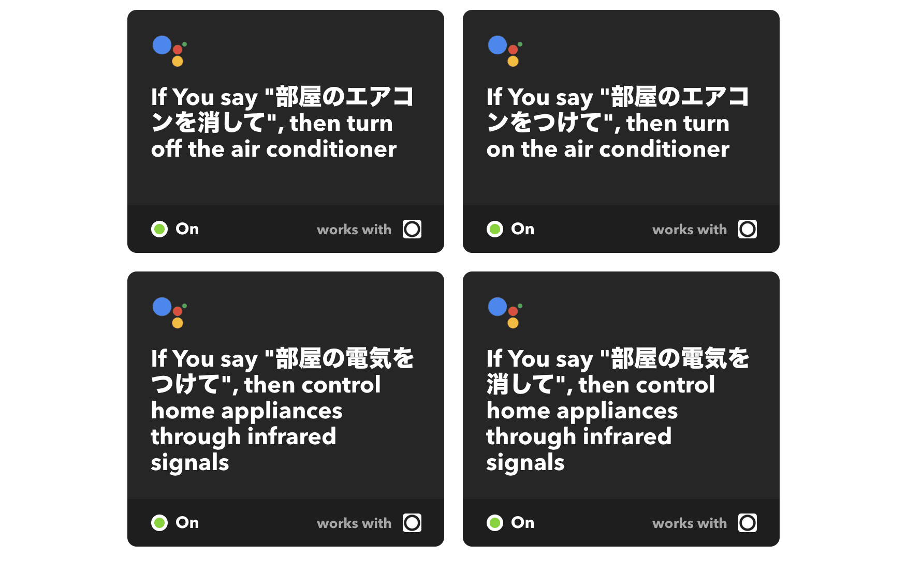

既に情報は出回っており目新しいものではないが、ようやく Google Home と Nature Remo を連携して声で家電を操作できるようになったので、その作業ログをまとめておく。

## Nature Remo とは

[Nature Remo](https://nature.global/) は家電をスマートフォンなどから操作するためのハブとなるデバイスである。

Nature Remo は赤外線を発信できるようになっており、これによってエアコンやライトなどの赤外線リモコンで操作する家電を操作できる、という理屈である。Nature Remo はインターネットを通してアプリなどから操作できるので、家にいるときはもちろんのこと、外出中でも Nature Remo を操作し、家電の管理が可能である。赤外線で操作できるデバイスならなんでも良いので、抜群に汎用性が高い。

<iframe loading="lazy" src="https://www.youtube.com/embed/U0jAX-hKW3A" title="YouTube video player" allow="accelerometer; autoplay; clipboard-write; encrypted-media; gyroscope; picture-in-picture; web-share" allowfullscreen></iframe>

## Nature Remo でエアコンやライトを操作する

手始めにエアコンを Nature Remo から操作できるようにしてみる。といっても、もともと赤外線リモコンで操作する家電なので Nature Remo をセットアップし、エアコンまで赤外線が届く場所に配置すれば良い。あとは Nature Remo のアプリをインストールすれば使えるようになる。スマートフォンよりは使う頻度が低いせいか、よくリモコンを見失うので、使う必要がなくなるだけでも便利だったりする。

あとは天井の照明を Nature Remo で操作できるようにしてみよう。もともと家に備え付けのライトはなく、無印良品のペンダントライトに LED 電球を付けて使っていた。

<affiliate-link
  src="https://images-na.ssl-images-amazon.com/images/I/61k9jX3DGYL._SX425_.jpg"
  href="https://www.amazon.co.jp/dp/B0716KGVFM/"
  tag="1000ch-22"
  title="ボンコシ　LED電球 E26口金 100W形相当 1100lm 昼光色相当(13W) 一般電球・ボール電球タイプ・95mm径">
  口金：E26 演色指数(CRI)：80Ra以上
  入力電圧：AC100－240V　50/60HZ 入力電流：0.11A
  定格消費電力:13W　全光束：1100lm
  ビーム角：270°　色温度：6000K　サイズ：Φ95*138mm
</affiliate-link>

そのため照明のオンオフを切り替えるには壁にあるスイッチを押すしかなかったのだが、これについては [@horimislime](https://twitter.com/horimislime) に教えてもらった天井とペンダントライトの間に装着するリモコンスイッチを中継することで、まずは赤外線リモコンで操作できるようにした。

<affiliate-link
  src="https://images-na.ssl-images-amazon.com/images/I/710j2hSaJcL._SX425_.jpg"
  href="https://www.amazon.co.jp/dp/B01ABMGF1Y/"
  tag="1000ch-22"
  title="天井照明器具専用 リモコンスイッチ [品番]07-8250 OCR-04W">
  サイズ:8.3×9.6×4.5cm
  本体重量(kg):0.115
</affiliate-link>

1. Nature Remo アプリの Control タブから+ボタンをクリックし、新たなコントロールを追加する
2. Nature Remo 本体に向けて登録したいリモコンの操作を実行する
3. プリセットとして登録されている場合は自動的に認識されるのでそれを利用する
4. プリセットとして登録されていない場合は、それが何の操作なのかわかるような名前やアイコンを設定する

これで Nature Remo アプリの Control タブに新しいコントロールが追加される。この時点で、追加したコントロールから家電を操作できるかどうか確認しておくと良い。

## Google Home で Nature Remo を操作する

言わずと知れているが Google Home は Google Assistant の音声インターフェースである。Nature Remo も Google Assistant も IFTTT に対応しているので、Google Home → IFTTT → Nature Remo → 家電というルートで命令できる。

Nature Remo のレシピは既にたくさんあるので、Google Assistant のレシピからフックを作成すれば、後は容易い。

1. [IFTTT から Google Assistant へのアクセス](https://ifttt.com/google_assistant)を許可する
2. [IFTTT から Nature Remo へのアクセス](https://ifttt.com/nature)を許可する
3. [New Applets](https://ifttt.com/create) から新しいアプレットを作成する
4. **this** から Google Assistant を選択し、 **Say a simple phrase** でトリガーになるキーワードを入力する
5. **that** から Nature Remo を選択し、 **Control home appliances** で実行するアクションを選択する

IFTTT 経由で Nature Remo を操作するコツとして、先の4のステップで **Google Home のネイティブで反応するキーワードで登録しない** 必要がある。今回は「部屋のエアコンをつけて」「部屋の電気をつけて」というキーワードで登録したが、ここで単に「エアコンをつけて」「電気をつけて」とすると、Google Home ネイティブでエアコンやライトと連携できる機能が反応してしまい、IFTTT まで命令が届かない。
