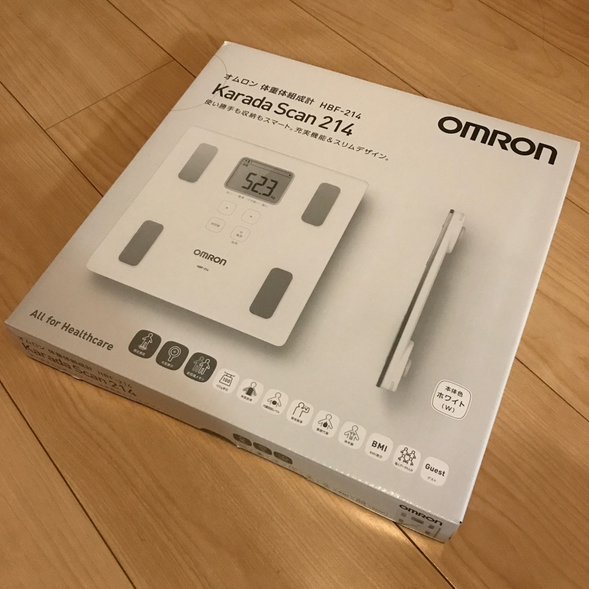

前回の健康診断から 4kg 増えている（58kg -> 62kg）とのことで、計測員のお姉さんに心配されて以来体重を気にしている。年齢的にも本格的に運動で絞っていかないとマズイと危機感を感じたので、ゴールデンウィークあたりから継続的に週一程度でランニングをしている。実際に体重がどうなっているのかを知りたい時に、ふと体重計がないことに気づき、買ってみた。

<affiliate-link
  src="https://images-na.ssl-images-amazon.com/images/I/81DHIyoFcWL._SX425_.jpg"
  href="https://www.amazon.co.jp/dp/B005JVBDG0/"
  tag="1000ch-22"
  title="オムロン 体重・体組成計 カラダスキャン ホワイト HBF-214-W">
  サイズ:約幅285×高さ28×奥行280mm。本体重量:約1.6kg(電池含む)。素材・材質:ABSガラス、ABS樹脂。体重:0～100kgまで/100g単位、100～135kgまで/200g単位
</affiliate-link>

どうせなら Wi-Fi で接続して、計測したら自動で集計して…みたいな機能付きのものを探して買っても良かったのだが、安くて安心のオムロンに着地した。自分の基礎データ（年齢と身長と性別）を登録して測ると、体組成データも出力できるっぽい。

自分の健康管理は iOS 純正のヘルスケアアプリを使っているので、計測結果をアナログ入力している。睡眠状況等も自動で計測されている他、ランニングの結果も Apple Watch を通してログが取れているので、自動で同期されている。

ランニングを始めて2ヶ月程度だが、買った直後の体重は 59.9kg だった。その後は 60kg 前後をウロウロしているので、もう 2kg~3kg は絞りたい。
