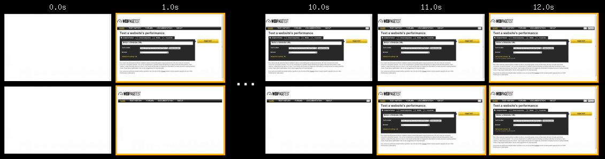
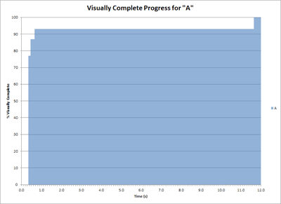
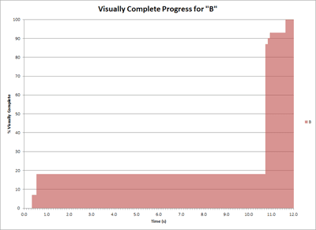
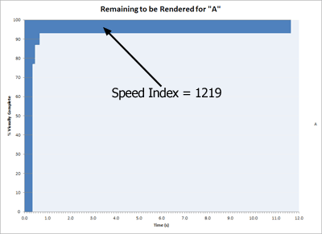
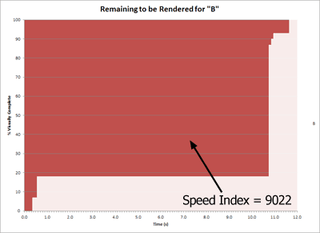
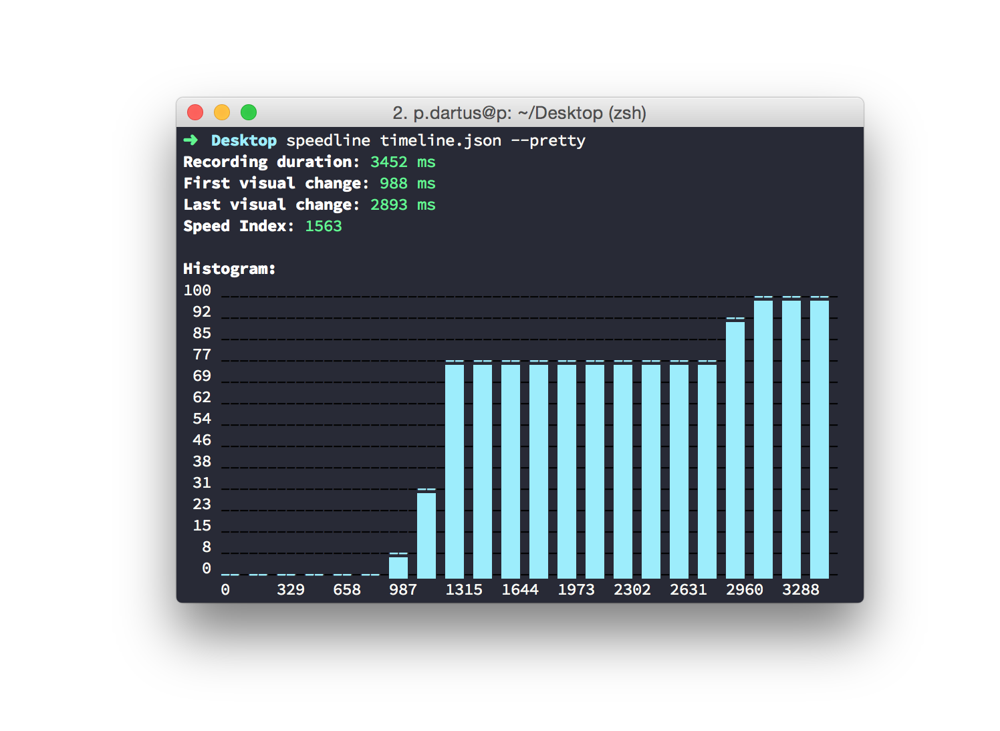

Web パフォーマンスの文脈で語られてきた `DOMContentLoaded` や `load` といった、いわゆるロード速度として括られてきた指標は、ユーザー体験とパフォーマンスの相関を俯瞰する上でいまや適切ではない。

`DOMContentLoaded` は DOM ツリーと CSSOM ツリーを組み合わせたレンダーツリーの準備完了を指し、ひとつの Web クライアントサイドでできる最適化の指標だが、それでも描画状態はレンダーツリーの複雑さやスクリプト処理との兼ね合いに依存してくるので、**如何に素早くページが表示されているか** ということを正確に表現できない。

`load` は HTML ドキュメントから参照する画像などのサブリソースのロードが全て完了した状態で、この頃にはページ全体が表示完了している状態に近い。しかし長大なコンテンツでは、ユーザーがページの最下部まで見る保証はなく（むしろ見ないのが大半）、**より重要であろうファーストビューの表示が早かったか** はわからない。

Speed Index は Google が提唱する、**ロード開始からファーストビューが如何に早く表示されるかを表すスコア** である。

## Speed Indexの考え方

同じコンテンツのページ A とページ B があったとして、どちらもロード開始から 11 秒時点でファーストビューの表示が 100% 完了するものとする。しかしページ A とページ B では経過時間に対するファーストビューの表示状況が異なり、ページ A はロード開始から 1 秒時点で 80% 表示されていて、かたやページ B はロード開始から 1 秒時点で 20% しか表示されていない。この時、ページ A の方がユーザー体験が良いのは明らかである。

この時ページ A とページ B の差は、 **ロード開始からの経過時間に対する描画進捗** である。両ページの描画進捗を、X 軸に経過時間、Y 軸に描画進捗にとるグラフにすると次のようになる。

このグラフによって、ファーストビューがロード開始から如何に早く多く描画されているかを表現できている。この色付き部分を比較しても良いが、仮に描画が 99% でずっと止まるようなケースでは色付き部分の面積が大きくなり続けてしまう。なので、経過時間に対して描画されていない量（面積）を計算することで、スコアを有限にできる。これが Speed Index である。

スコアの算出計算式などの詳細は、以下の公式ドキュメントを参照してほしい。

- [Speed Index - WebPagetest Documentation](https://sites.google.com/a/webpagetest.org/docs/using-webpagetest/metrics/speed-index?hl=ja)
- [Speed Index | Web | Google Developers](https://developers.google.com/web/tools/lighthouse/audits/speed-index?hl=ja)

## Speed Indexの算出手段

Speed Index の算出方法はいくつかある。どれも先の考え方に沿っているものの、基づくデータが様々なので、異なるツールで割り出された Speed Index 同士を比較はできないだろう。

### WebPageTest.org

[WebPageTest](https://www.webpagetest.org/) は Google が開発する Web ページのパフォーマンスを解析するツールである。先のドキュメントからもわかるが、SpeedIndex のアイデア元でありオリジナルの実装。オープンソースなので、AWS 上にデプロイして自身でホストなども可能である。

チェックしたい URL を入力しテストを実行すると、AWS のインスタンスのテストエージェント（Chrome や Firefox など）がその URL に実際にアクセスして、その情報を元に様々な解析を行うという仕組み。インスタンスの場所やネットワークの速度を指定してテスト実行するので、実際のユーザー体験を想定したテストというよりは Web アプリケーションのボトルネックを検出するためのツールとしての意味合いが強い。この WebPageTest をラップして定期実行などの機能を追加することで、より Synthetic Monitoring に近づけているのが [SpeedCurve](https://speedcurve.com/) にあたる。

WebPageTest ではテストエージェントによるアクセス時に、その Web ページをビデオキャプチャして、フレームから描画進捗を割り出し、Speed Index を算出している。

### [paulirish/speedline](https://github.com/paulirish/speedline)

speedline は DevTools のフレームキャプチャ付きのタイムラインデータを利用し、描画進捗は [SSIM](https://en.wikipedia.org/wiki/Structural_similarity) によって算出している。

コマンドラインから使えるし見た目もわかりやすくて良いが、DevTools のデータを必要とするので実行環境のネットワークやマシンスペックにテスト結果が依存する。テスト環境を固定化できれば Synthetic Monitoring にも使えそうだが、手元でのデバッグ用と割り切るほうが良さそう。

### [WPO-Foundation/RUM-SpeedIndex](https://github.com/WPO-Foundation/RUM-SpeedIndex)

RUM-SpeedIndex は、ブラウザが Web ページにアクセスしたときのリソースのロード状況を取得する [Resource Timing API](https://developers.google.com/web/tools/chrome-devtools/network-performance/understanding-resource-timing?hl=ja) を用いて Speed Index を計算している。WebPageTest の作者である [Patrick Meenan](https://github.com/pmeenan) 謹製のツールで、ブラウザスクリプトで完結するので実際のユーザー環境での Speed Index を算出可能な、今のところ最も現実的な手段である（名前の通り Real User Monitoring にフォーカスしている）。

この RUM Speed Index の値、つまりリアルユーザーが体験しているパフォーマンスのスコアを、例えばプロジェクトで使用している Google Analytics に送信すれば、パフォーマンスと離脱率や Page Views/Session 、そしてプロジェクトの重要 KPI との相関を可視化できる。WebPageTest や SpeedCurve のような Synthetic Monitoring と併用していくと良さそうだ。

### 余談

この手の計算された値は、標準化されるイメージが沸かないが、気持ちとして…。

<blockquote class="twitter-tweet" data-lang="ja">
Performance API あたりで Speed Index 取得できるようになりますように🙏 <a href="https://t.co/IVTMlbeEkf">https://t.co/IVTMlbeEkf</a>  は、良いんだけど DevTools 頼みなのでモバイルでアレ
&mdash; 煎茶 🍵 (@1000ch) <a href="https://twitter.com/1000ch/status/868853133857837056">2017年5月28日</a></blockquote>
