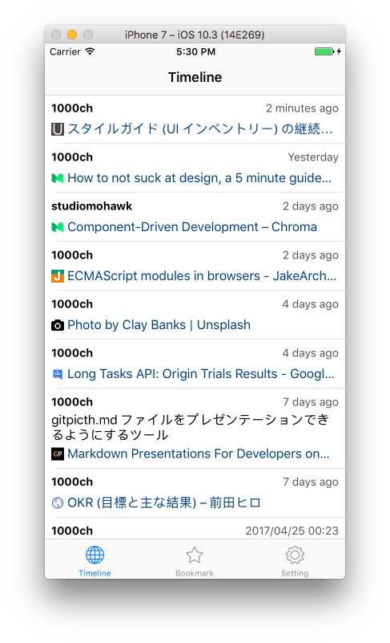
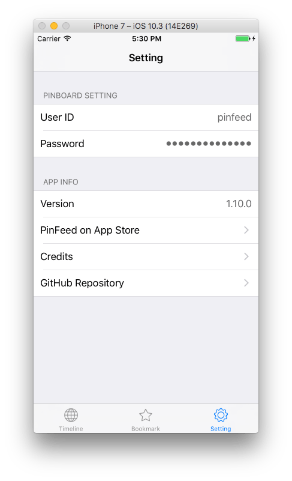

PinFeed は趣味で作っている Pinboard の iOS クライアントで、自分がフォローしているユーザーのブックマークにフォーカスしているのが特徴（[HBFav に強くインスパイアされている](http://d.hatena.ne.jp/naoya/20111111/1320965898)、というかそのまま）。[リリース自体はかれこれ1年以上前](/posts/2016/pinfeed-for-pinboard/)だが、こつこつメンテナンスを続けていて、Swift のメジャーアップデートなどにも追従している。

## 新しいアイコンとデザイン調整

アイコンを新調した。Sketch の使い方を勉強する良い機会なので、今まで使っていた Public Domain のアイコンを参考に、ゼロから描いた。

アイコン以外にも、UI 周りのカラーコントラストなどを細かく調整している。

## 内部処理のアレコレ

リリース当初は保持しているトークンを使って、毎度 API へリクエストしたデータを表示していた。が、ロードが重い上にサーバーにもクライアントにも優しくないのはわかっていたので、途中から Realm を使ってデータをキャッシュし始めた。新しいデータを毎回取得したい気もするが、ひとまずキャッシュデータを優先的に表示させることで、一応の改善を果たした。

Swift のメジャーアップデート対応はそれなりに辛くて、毎度骨が折れる。というのは、これに手を付けるときは毎回のように Xcode のアップデートやら iCloud の認証やらが入るからだ。コードベースがそこまで大きくないこともあり、Swift のマイグレーション自体はそこまで辛くない。Web クライアントサイドのプロジェクトを開始するときの環境整備も一仕事だが、本作業に入る前の避けようがないタスクとして近い感覚を覚える。
