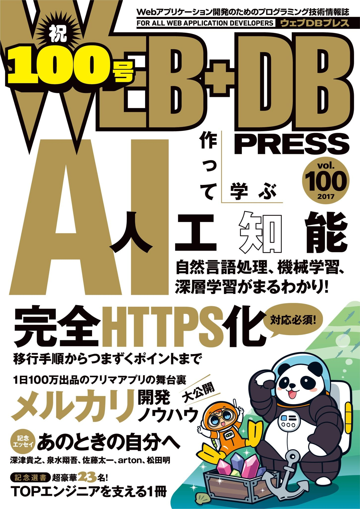

WEB+DB PRESS の Vol.100 というメモリアル号の **「あのときの自分へ ── もし、過去に戻ってアドバイスできるなら」** というエッセイ企画に **「Web 技術の変化に適応し続けるには」** というタイトルで寄稿しました。この業界に飛び込んではや五年が経ちますが、Web の変遷を振り返って思うところを書き綴っています。

表紙に名前を載せていただいていますが、並びが非常にアレで恐縮しています。どうぞお手柔らかにお願い致します。

<blockquote class="twitter-tweet" data-lang="ja">
100号記念エッセイは「あのときの自分へ」で、深津 貴之さん（<a href="https://twitter.com/fladdict">@fladdict</a>）、泉水 翔吾さん（<a href="https://twitter.com/1000ch">@1000ch</a>）、佐藤 太一さん、artonさん、松田 明さん（<a href="https://twitter.com/a_matsuda">@a_matsuda</a>）執筆です。<a href="https://twitter.com/hashtag/wdpress?src=hash">#wdpress</a>
&mdash; WEB+DB PRESS編集部 (@wdpress) <a href="https://twitter.com/wdpress/status/900639275540070400">2017年8月24日</a></blockquote>

<affiliate-link
  src="https://images-na.ssl-images-amazon.com/images/I/61EEU3dmOUL._SX352_BO1,204,203,200_.jpg"
  href="https://www.amazon.co.jp/dp/4774191299/"
  tag="1000ch-22"
  title="WEB+DB PRESS Vol.100">
</affiliate-link>
