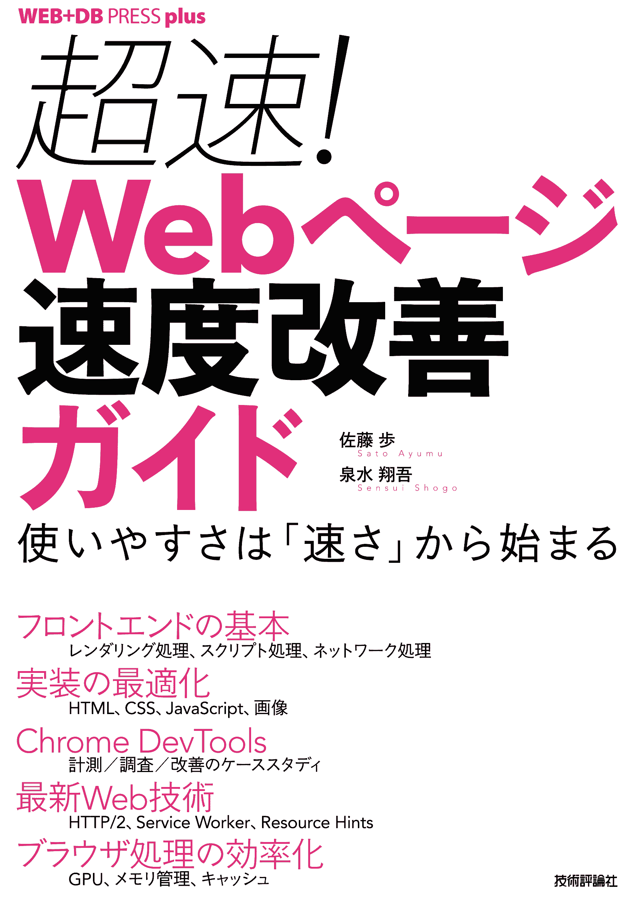

事前に各所で告知していた通り、この度 **[超速! Webページ速度改善ガイド ── 使いやすさは「速さ」から始まる](https://www.amazon.co.jp/dp/477419400X/?tag=1000ch-22)** という共著の書籍が、技術評論社より出版されます。名前の通り Web サイトを高速化する知識を得るための本です。

## 本書の概要

[技術評論社の Web サイト](http://gihyo.jp/book/2017/978-4-7741-9400-4)の通りですが、目次は次のようになってます。

まず1章で Web パフォーマンスとはなんなのかを、ビジネスへの影響やユーザー環境の多岐化、高度化する Web 技術などの観点で解説します。2章以降では、Web パフォーマンスをネットワーク、レンダリング、スクリプトといった技術要素に分解し、それぞれの基礎知識を抑えつつケーススタディを学んでいきます。また、8章では画像全般（画像フォーマット、最適化方法、レスポンシブなロードなど）について、9章ではネットワーク周辺の新たな技術（Service Worker と Resource Hints）について解説しています。

- 第1章：Webページの速度
- 第2章：ネットワーク処理の基礎知識
- 第3章：ネットワーク処理の調査と改善
- 第4章：レンダリング処理の基礎知識 
- 第5章：レンダリング処理の調査と改善
- 第6章：スクリプト処理の基礎知識
- 第7章：スクリプト処理の調査と改善
- 第8章：画像の最適化に役立つテクニック
- 第9章：ネットワーク処理の効率化に役立つポイント

本書は **「○○ファイルを結合してリクエスト数を減らす」** **「GPU を有効化する○○プロパティを適用する」** **「Service Worker を使ってアセットをキャッシュする」** といったような Tips を集めたものではありません。Web ページやブラウザ内部の仕組みを体系的に解説することで、Web ページが遅くなってしまう原因を調査する力と対処する知識を抑えつつ、Web パフォーマンスについての本質的な理解を促します。[続・ハイパフォーマンスWebサイト](https://1000ch.net/posts/2015/even-faster-web-sites.html)、[ハイパフォーマンス ブラウザネットワーキング](https://1000ch.net/posts/2014/high-performance-browser-networking.html) あたりの内容を、昨今の Web 事情にあわせてアップデートしている一冊です。

しばしば「どっち（[@ahomu](https://twitter.com/ahomu) or [@1000ch](https://twitter.com/1000ch)）がどこを書いたんだ」と聞かれますが、草稿時点で大まかな分担はあったものの、全体のリファクタリングを両者で繰り返した結果、誰がどの文を書いたのかは正直わからない状況です。真実は `git blame` のみぞ知る。

## 書き終えてみて

今まさに業務で Web の品質を啓蒙する立場にあり、そのひとつとしてパフォーマンスにも取り組んでいますが、思い返してみると Web パフォーマンスに関して勉強しはじめたのはサイバーエージェントに転職して間もないころに、[Fluid User Interface with Hardware Acceleration](https://www.youtube.com/watch?v=gTHAn-nkQnI) という動画をパイセンの逐次翻訳+解説付きで見たのがきっかけでした。どちらかというとブラウザ内部のレンダリングの仕組みそのものについて解説されていて、当時の自分にとっては非常に衝撃だったのを覚えています。

<iframe loading="lazy" src="https://www.youtube.com/embed/gTHAn-nkQnI" title="YouTube video player" allow="accelerometer; autoplay; clipboard-write; encrypted-media; gyroscope; picture-in-picture; web-share" allowfullscreen></iframe>

そこから Web パフォーマンスという分野に没頭していったわけですが、自分のアクティビティを漁ってみると Web パフォーマンスに関するアウトプットが思いの外ありました。

- [Browser Computing Structure // Speaker Deck](https://speakerdeck.com/1000ch/browser-computing-structure)
- [Re-think about Web Performance // Speaker Deck](https://speakerdeck.com/1000ch/re-think-about-web-performance)
- [WEB+DB PRESS Vol.87 Webフロントエンド最前線「ユーザを待たせない高速なWebサイト」 - EagleLand](https://1000ch.net/posts/2015/wdpress-frontend-series-network.html)
- [WEB+DB PRESS Vol.88 Webフロントエンド最前線「スムーズなUIを実現するレンダリング速度の改善ノウハウ」 - EagleLand](https://1000ch.net/posts/2015/wdpress-frontend-series-render.html)
- [AbemaTVのランタイムパフォーマンスのAudit - EagleLand](https://1000ch.net/posts/2016/abematv-runtime-perf-audit.html)
- [WebパフォーマンスとプロダクトKPIの相関を可視化する話 - CyberAgent Developers Blog](https://developers.cyberagent.co.jp/blog/archives/9540/)

こうした Web パフォーマンスに関する取り組みの集大成として、書籍という形で世に送り出すことができました。大変だったけど正直ホッとしています。

共同執筆者の佐藤歩さんについては、この記事の読者であれば、私から改めて言わずとも人となりを知っているかと思いますが、本書のクオリティは彼なしには有り得ませんでした。また、編集担当として本書の校正作業にずっと関わっていただいた技術評論社の稲尾さんには本当に頭があがりません。WEB+DB PRESS の連載、Web フロントエンド最前線から数えると約3年半もの間、拙い文章の校正をして頂きました。

## 何卒

宜しくお願い致します。

<affiliate-link
  src="https://images-na.ssl-images-amazon.com/images/I/51KTTrbtbTL._SX350_BO1,204,203,200_.jpg"
  href="https://www.amazon.co.jp/dp/477419400X/"
  tag="1000ch-22"
  title="超速!  Webページ速度改善ガイド ── 使いやすさは「速さ」から始まる (WEB+DB PRESS plus)">
  佐藤 歩 (著), 泉水 翔吾 (著)
</affiliate-link>

**超速!** ということで、当初予定していたハッシュタグは [#超速本](https://twitter.com/hashtag/超速本?src=hash) ですが、とあるツイートによって [#チョッパヤ本](https://twitter.com/hashtag/チョッパヤ本?src=hash) というハッシュタグが追加されたようです。使いやすい方をお使いください。
