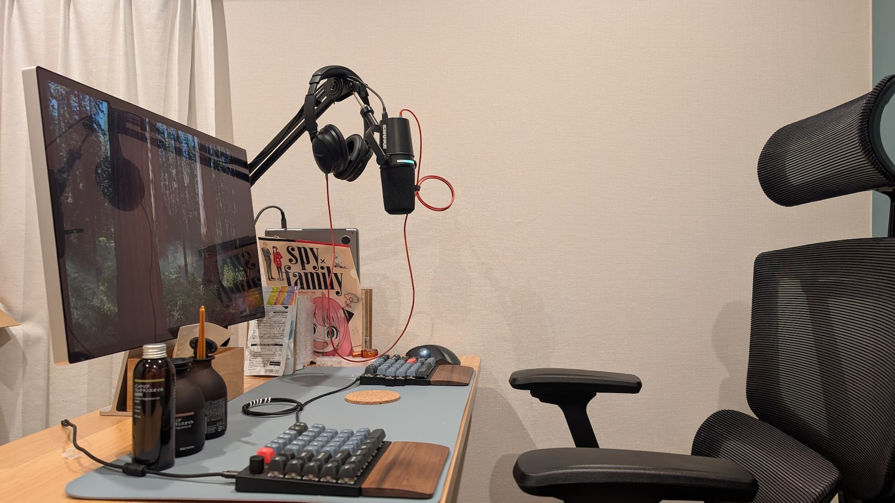
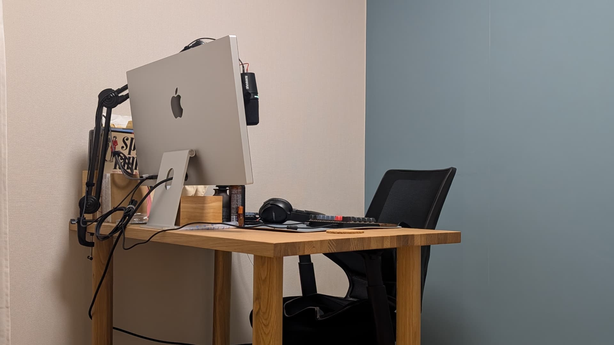
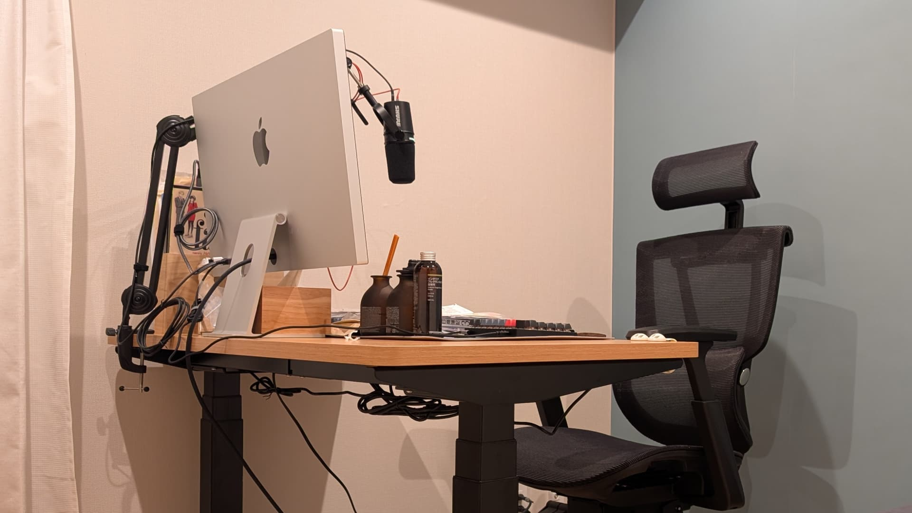

今年も書きます。

- [2015年に買って良かったもの](/posts/2015/bought-in-2015/)
- [2016年に買って良かったもの](/posts/2016/bought-in-2016/)
- [2017年に買って良かったもの](/posts/2017/bought-in-2017/)
- [2018年に買って良かったもの](/posts/2018/bought-in-2018/)
- [2019年に買って良かったもの](/posts/2019/bought-in-2019/)
- [2020年に買って良かったもの](/posts/2020/bought-in-2020/)
- [2021年に買って良かったもの](/posts/2021/bought-in-2021/)
- [2022年に買って良かったもの](/posts/2022/bought-in-2022/)
- [2023年に買って良かったもの](/posts/2023/bought-in-2023/)

## COROS PACE 3 と Shokz OpenFit Air

遂に COROS PACE 3 を買った。COROS PACE 2 の機能性に不満があったわけではないが、最新モデルを使っているという安心感は替え難い。ちなみに、更に新しい [COROS PACE Pro](https://jp.coros.com/pacepro) というモデルも発売されている。

<affiliate-link
  src="https://m.media-amazon.com/images/I/71zDoGZjJgL._AC_SL1200_.jpg"
  href="https://www.amazon.co.jp/dp/B0CFQFSTSN"
  tag="1000ch-22"
  title="COROS PACE 3">
ランニングやトライアスロンなどスピードを求める方向け。一日中装着し続けてもストレスがない軽量性。充電の心配がないロングバッテリー。常時点灯の1.2インチ透過型タッチスクリーンディスプレイ。2周波GPS、次世代光学式心拍、高度計で正確なデータ提供。ルートナビゲーション、音楽機能を搭載。ウォッチバンドと充電ケーブルが付属
</affiliate-link>

COROS PACE 3 はランニング時に活躍しているが、ランニングのお供としてオープンイヤー型のイヤホンは欠かせない。走っている間に読書するわけにもいかないので聴覚を活用したいわけだが、今までは[2022年に購入した Aeropex](/posts/2022/bought-in-2022.html) を使っていた。今年は同じく Shokz の OpenFit Air を購入した。

<affiliate-link
  src="https://m.media-amazon.com/images/I/51QqxQ7y0mL._AC_SL1500_.jpg"
  href="https://www.amazon.co.jp/dp/B0CT7C1CP1"
  tag="1000ch-22"
  title="Shokz OpenFit Air">
耳の穴をふさがず、聞き疲れや蒸れを感じず、ソフトなシリコンで仕上げたイヤーフックが、イヤホンをぴったりと固定します。わずか8.7gの軽量デザインにより、長時間のリスニングでも圧迫感を最小限に抑え、メガネをかけたままでも、快適な装着感をお楽しみいただけます。
</affiliate-link>

左右分離という点はさておき、ケースに収めれば非常にコンパクトでありケース自体を充電しておけるので、電源がなくとも充電できる。また、ケースの接続が USB-C であることは非常にありがたい。COROS 製品も見習って、USB-C 接続に揃えて欲しいと切に願う。

## SHURE MV7+ と AudioTechnica のマイクアーム

SHURE 製品の良さは知っていたが、よりポータブルに使えるダイナミックマイクで探していたところ、MV7 を見つける。しかし、接続が microUSB で長らく二の足を踏んでいた。そして、ついに後継として USB type-C バージョンとなる MV7+ が発売されたので、即座に購入した。

<affiliate-link
  src="https://m.media-amazon.com/images/I/81gr-VKFZnL._AC_SL1500_.jpg"
  href="https://www.amazon.co.jp/dp/B0CYYZ78NJ"
  tag="1000ch-22"
  title="SHURE MV7+">
MV7+はカスタマイズ可能なLEDタッチパネル、強力なDSP機能、より上質な音声を備え生まれ変わった、音にこだわるストリーマー、ポッドキャスター、ミュージシャンのためのダイナミック型マイクロホンです。この新しいマイクロホンは、USB-CおよびXLR出力、強化されたオートレベルモード、デジタルポップフィルター、リアルタイム・デノイザーおよびリバーブ効果を備えています。タッチ式ミュートLEDパネルは多彩なカラーオプションが用意されていて、収音する音声と同様に独自性を持たせることができます。
</affiliate-link>

Audio Technica のマイクアームも併せて購入し、音声周りの機材は充実してきた。もっと廉価なマイクアームも発売されているが、さすがは Audio Technica といったところで、高い機能性かつ安っぽさがない。

<affiliate-link
  src="https://m.media-amazon.com/images/I/61v9IynTUDS._AC_SL1500_.jpg"
  href="https://www.amazon.co.jp/dp/B097T52LPB"
  tag="1000ch-22"
  title="オーディオテクニカ AT8700J マイクアーム">
耐荷重 : 2kg / 可動距離 : 680mm / テーブルクランプ最大開口 : 50mm
取り付けねじ寸法 : 5/8インチねじ
回転角度 : アーム取付部：360°マイクロホン取付部：270°
上部アーム部：180°、下部アーム部：135°
外形寸法 : 430mm×398mm / 質量 : 本体：1030g、テーブルクランプ：172g
</affiliate-link>

## Apple Studio Display

友人から譲り受けた [LG UltraFine 5K Display 27インチ](/posts/2022/lg-ultrafine-display-27inch/) を満足して使っていたが、その友人が「後継機に Apple Studio Display を買った」と、ランチをしていたときに唆されて、購入することになった。

<affiliate-link
  src="https://m.media-amazon.com/images/I/715IjfY5t6L._AC_SL1500_.jpg"
  href="https://www.amazon.co.jp/dp/B09V48FB91"
  tag="1000ch-22"
  title="Apple Studio Display">
臨場感あふれる 27 インチの 5K Retina ディスプレイ*。センターフレームに対応した 12MP 超広角カメラ、スタジオ品質のマイク、6 スピーカーサウンドシステムを搭載。どんな Mac とも強力なペ アになります。600ニトの輝度を持ち、10億色とP3の広色域に対応する臨場感あふれる27インチの5KRetinaディスプレ イ
</affiliate-link>

5K Retina Display、Thunderbolt ポートと USB-C ポート x3、超広角カメラなどスペックも非常に似ており、価格差ほどの性能差があるのかと言われると微妙だが、「かっこいい」という点だけは比べ物にならない。Nano-texure ガラスや VESA マウントかどうかは選択可能なので、オプションは要件に応じて慎重に選びたい。

## HHKB Studio 英字配列と Mac mini

我が家にはテレビがないので、43 インチのディスプレイを Mac mini に接続して YouTube や Amazon Prime などをリビングで鑑賞している。そこで問題になるのが、それをどのように操作するのか、だ。

今までは Mac ユーザーらしく Magic Keyboard と Magic Trackpad を使っていたが、いくつか難点があった。その薄さゆえに持ち運び難く、2つが独立していること。そして極めつけは充電に Lightning ケーブルを要求される点である。接続についてはようやく Type-C バージョンが発売されているものの、取り回しは解決されないので解決策を探していたところで HHKB Studio を発見した。

<affiliate-link
  src="https://m.media-amazon.com/images/I/71Bi0U+haHL._AC_SL1500_.jpg"
  href="https://www.amazon.co.jp/dp/B0CL79KXBG"
  tag="1000ch-22"
  title="HHKB Studio 英字配列">
4つのジェスチャーパッド搭載。指先ひとつでボリューム操作などのアナログ量調整や、ウィンドウ切り替えができます。機能はカスタマイズ可能で、よく使うアプリのコマンドを割り当ててることもできます。キーボード中央にポインティングスティック、スペースキーの下に3つのマウスボタンを配置。マウス機能が統合されているため、タッチパッドやマウスは不要です。どこでも没入して快適なタイピングが可能です。
</affiliate-link>

<affiliate-link
  src="https://m.media-amazon.com/images/I/71aOzYidoWL._AC_SL1500_.jpg"
  href="https://www.amazon.co.jp/dp/B0CQK939MJ"
  tag="1000ch-22"
  title="UNNIK 単三電池 充電式 4本セット">
UNNIKの単3形充電池は大容量で、他の単3形リチウム電池よりも少なくとも25％多くの持続時間を持ちます。1000回以上の充放電サイクルを経ても耐久性があり、使用頻度と交換コストを大幅に削減します。
便利な高速充電：UNNIKの単3形電池は、4口のType-Cから直接充電でき、LED充電表示灯が付いており、4-in-1 USB Type C充電ケーブルを使用して1.5時間で急速充電が完了し、利便性と適用範囲が大幅に向上します。
</affiliate-link>

長らくソフトウェア開発に関わっており、HHKB のファンが多いことは認識していた。なんなら REALFORCE を使っていた時期はあったが、HHKB を使ったことがなかった。打ち心地にも慣れて問題ないし、ThinkPad ユーザーはおなじみのトラックポイントも何とか使えている。

2020 年に鳴り物入りで発売され、長らくお世話になっていた Mac mini M1 も Mac mini M4 に買い替えた。M1 と M4 の性能差は、Intel から M1 への変化と比べると大きくないので当時ほどの感動はないが、筐体は小さく美しいのでとても満足している。

<affiliate-link
  src="https://m.media-amazon.com/images/I/71VCsDct8VL._AC_SL1500_.jpg"
  href="https://www.amazon.co.jp/dp/B0DLCCBD1H"
  tag="1000ch-22"
  title="Apple Mac mini 2024">
もっとミニ。もっとパワフル ̶ どこまでもパワフル。それなのに、驚くほど小さくなった Mac mini デスクトップコンピュータは、12.7 センチ四方のボディに、とてつもないパワーがぎっしり。Apple Intelligence のために設計されました*。圧倒的な M4 チップのスピードと性能をフルに発揮するために、Apple シリコンに合わせて作り直しました。便利なポートを背面に、そして前面にも用意しています。
</affiliate-link>

## FlexiSpot の昇降デスクとチェア

デスクは無印良品の[木製テーブル天板](https://www.muji.com/jp/ja/store/cmdty/detail/4550182583137)と[木製テーブル脚](https://www.muji.com/jp/ja/store/cmdty/detail/4550182586176)、そして[背メッシュのワーキングアームチェア](https://www.muji.com/jp/ja/store/cmdty/detail/4550512926832)を組み合わせて使っていた。

不便はなかったが、[Black Friday に合わせて公開された Gizmode Japan の動画](https://youtu.be/0qbsAnqiKNI)にまんまと釣られて買ったのが FlexiSpot の昇降デスクとチェアである。昇降デスクをオフィスで使ったことはあり、自宅での導入にも興味はあった。ついでにチェアも昇降デスクに合わせて購入したが、アームレストやリクライニングのロックといった、細かな機能性が全体的にアップグレードしている。

<affiliate-link
  src="https://m.media-amazon.com/images/I/61Z5GjVNRYL._AC_SL1500_.jpg"
  href="https://www.amazon.co.jp/dp/B0CC1R13MZ"
  tag="1000ch-22"
  title="FlexiSpot の昇降デスク E7H">
このE7H昇降デスクは、身長に合わせて自由に調節できます！従来のE7と比較して、より高い位置まで昇降することができます。特に身長の高い方にとって、より快適な作業環境を提供することができます。昇降範囲： 63.5-128.5cm｜昇降速度：40mm/s｜耐荷重：160kg｜脚幅調整範囲 110~190cm｜対応天板サイズ 幅120～200cm 奥行60～80cm 厚み≥2cm
</affiliate-link>

<affiliate-link
  src="https://m.media-amazon.com/images/I/71ZgEkuDgTL._AC_SL1500_.jpg"
  href="https://www.amazon.co.jp/dp/B0CJQWW74B"
  tag="1000ch-22"
  title="FlexiSpot C7 Air">
バックレストは128度までリクライニング可能。強弱調節ノブで無段階に調節可能で、好きな角度で固定でき、集中したい時、リラックスしたい時も快適な座り心地を提供します。シートの高さは45.5-52.5cm、座面の奥行は6cm調節可能で、誰にでもフィットする柔軟なセッティングが可能。座面前傾角度調節機能を搭載しており、絵描きさんやイラストレーターの方にも向いており、長時間作業も楽に！
</affiliate-link>

## Alpaka のスリングバッグとキーチェーン

カバンと財布類の組み合わせは、最適解を目指して目ぼしいものを見つけては買い替えている。最近は Alpaka というブランドのシリーズを好んで使っている。スリングバッグについてはちょうど良いサイズ感で不満なく使っているが、正直他のブランドでも似たようなスペックのものもたくさんある。

<affiliate-link
  src="https://m.media-amazon.com/images/I/51aLF3POIHL._AC_SX679_.jpg"
  href="https://www.amazon.co.jp/dp/B0DL9M7SNP"
  tag="1000ch-22"
  title="Alpaka スリングバッグ">
前面コンパートメント：キーテザーを装備、 メインコンパートメント：ファスナー内 オープンポケット×2 オープンポケット×2 タブレットスリーブ×1、後部コンパートメント。表地 X-Pac(R) VX21 ナイロン、裏地 リップストップポリエステル(200D)。本体 610g 容量約5.5L。本体 タテ21cm×ヨコ32cm×マチ10cm、ショルダーストラップ 最大130cm
</affiliate-link>

Alpaka ブランドの特筆すべきは、この [HUB エコシステム](https://alpakagear.com/collections/hub-ecosystem)だろう。

<iframe loading="lazy" src="https://www.youtube.com/embed/7uWMfY1bRxg" title="YouTube video player" allow="accelerometer; autoplay; clipboard-write; encrypted-media; gyroscope; picture-in-picture; web-share" allowfullscreen></iframe>

日常的に持ち歩くものとしてスマートフォン・鍵・財布は無くしきれない葛藤があるが、[去年購入した Peak Design の Mobile Wallet](/posts/2023/bought-in-2023/) は状況を大きく改善した。それでも鍵自体をなくすことは難しかったが、このキーチェーンを使うことでカバンの一部として付帯できている。

<affiliate-link
  src="https://m.media-amazon.com/images/I/412G1TpM67L._AC_SX679_.jpg"
  href="https://www.amazon.co.jp/dp/B0C3LNBWYB"
  tag="1000ch-22"
  title="Alpaka Hub Keychain">
</affiliate-link>

<affiliate-link
  src="https://m.media-amazon.com/images/I/718ildDFYJL._AC_SL1500_.jpg"
  href="https://www.amazon.co.jp/dp/B0BN4PPMC2"
  tag="1000ch-22"
  title="Alpaka Zip Pouch Pro">
クレジット カードや紙幣などを収納できるメインコンパートメント、前面ファスナーポケットには、コイン、カード鍵などの小物を収納可能。また前面ファスナーポケットの下に小さな懐中電灯やライターなどの小物を入れるスペースが付いています。背面にも小さな工具やペンなどの小物を入れるポケットが2か所あります。
</affiliate-link>
