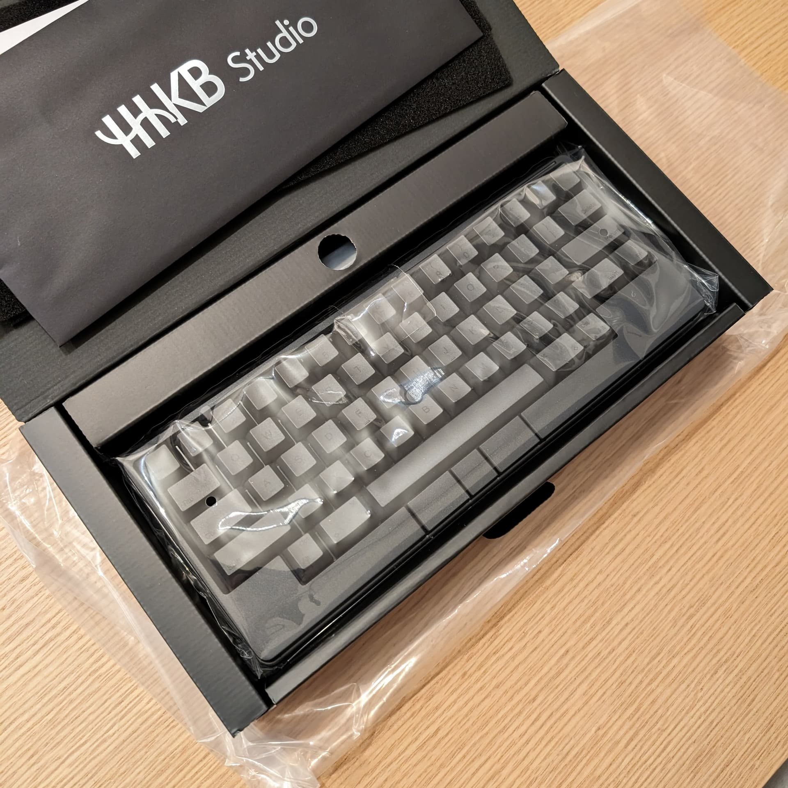
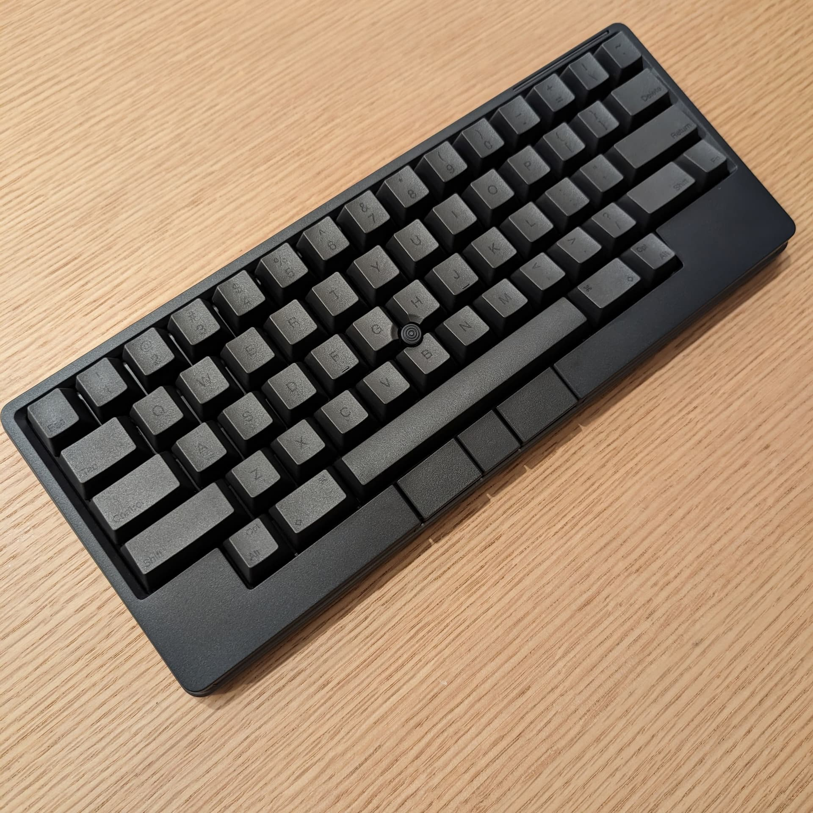

購入してから半年ほどが経過し、使い心地も慣れてきた。

Mac mini を [LG 4K モニター](https://www.amazon.co.jp/dp/B085Y5BB1L)に接続してリビングで使用しており、以前までは Magic Keyboard と Magic Trackpad を使っていたが、テーブルの上に機器が 2 つあることの取り回しの悪さを感じていた。そんな中でキーボードとポインタが一体化した機器を探していると、タイミング良く HHKB Studio が発売されたので購入した。

初めての HHKB だったが、気になっていたタイピング感も次第に慣れて心地良くなってきた。ポインティングスティックは「とても良い」とまではなっていないものの「充分に使える」という感じで、それよりは **キーボードとポインタが一体化しており Bluetooth による接続で気軽に持ち運んで使用できる** 便益の方が大きい。

Bluetooth だけでなく USB-C による接続および給電にも対応しているが、知人から「HHKB は内蔵バッテリーを傷めないように、電池が使えるようになっている」というコンセプトを教えてもらったこともあり、乾電池で運用している。墨色で刻印された US 配列のキートップもオシャレで良い。

<affiliate-link 
  src="https://m.media-amazon.com/images/I/61vJvilj-fL._AC_SL1500_.jpg"
  href="https://www.amazon.co.jp/dp/B0CL79KXBG"
  tag="1000ch-22"
  title="PFU キーボード HHKB Studio 英語配列">
4つのジェスチャーパッド搭載。指先ひとつでボリューム操作などのアナログ量調整や、ウィンドウ切り替えができます。機能はカスタマイズ可能で、よく使うアプリのコマンドを割り当ててることもできます。
キーボード中央にポインティングスティック、スペースキーの下に3つのマウスボタンを配置。マウス機能が統合されているため、タッチパッドやマウスは不要です。どこでも没入して快適なタイピングが可能です。
キーおよびジェスチャーパッドのキーマップ設定はHHKB本体に保存されるので、接続デバイスを替えても、ご自分のキーマップをお使いいただけます。キーマップのプロファイルは4つまで作成可能。DIPスイッチでカスタムキーの動作や省電力設定を設定できます。
PCとのUSB(Type-C)接続のほか、PC、タブレット、スマートフォン(iPad、iPhone、Android)へのBluetooth接続をサポート。最大4つまでのマルチペアリングが可能なので、接続するデバイスをすばやく切り替えられます。
60キー(英語配列)のコンパクトな設計は、最小限の指の動きで最大限の効率を実現します。リニアタイプの静音メカニカルスイッチによってノイズが軽減され、深い集中を可能にします。キーボード本体はホットスワップ方式を採用。ユーザーご自身でお好みのキースイッチに変更いただけます。
</affiliate-link>
