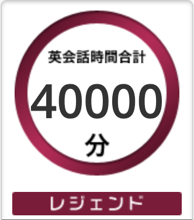

[オンライン英会話の学習時間が 30,000 分に到達して](/posts/2024/30000min-on-dmm-eikaiwa/)から丸 1 年少々が経過し、40,000 分に到達した。その間 437 日なので、400days x 25min で 10,000min になることを考えると、1ヶ月少々抜け落ちていることになる。体調不良等で数日受講できなかったことはあったが、正直1ヶ月も落とした記憶がないので、暇があったらログを辿ってみようと思う。

ここまで来ると、40,000 分という数字そのものに意味はなく、10,000 分単位でログに残してきたので今回も記録するくらいでしかない。肝心の英語力という意味でも、ある程度のレベルに達しているので、上達する感覚も薄い。しかし、きっと続けることには意義があるので今日も英会話を受ける。