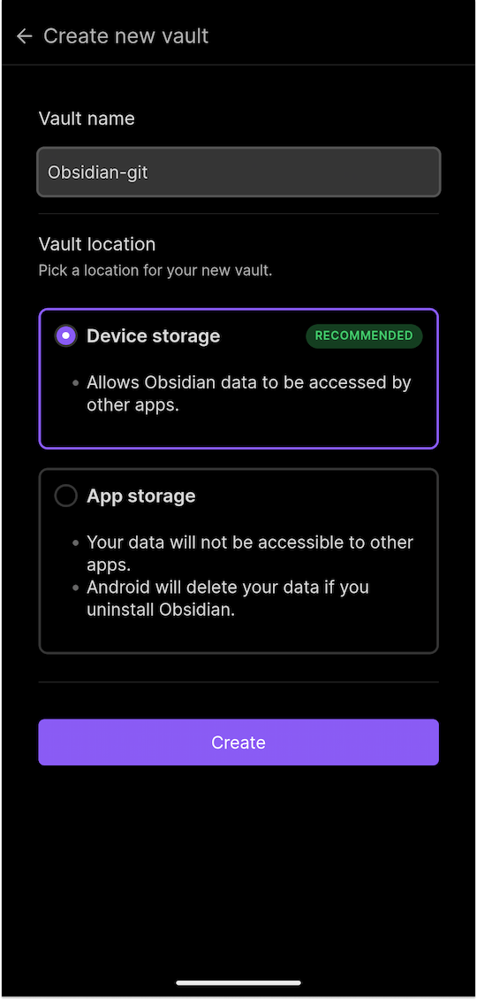
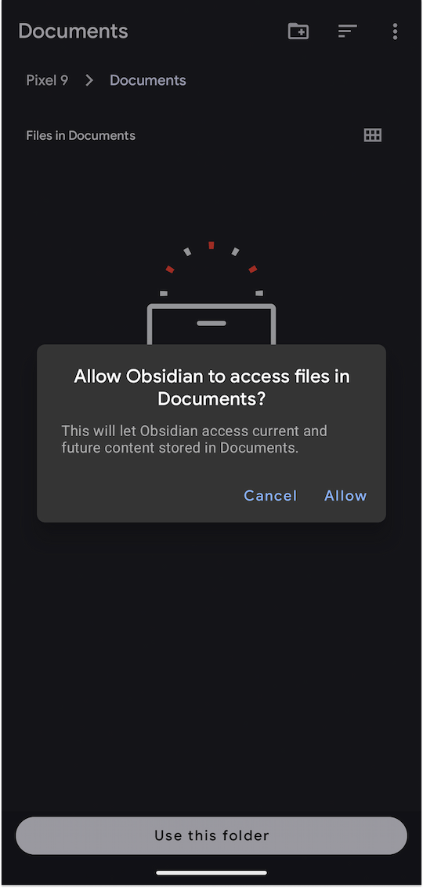
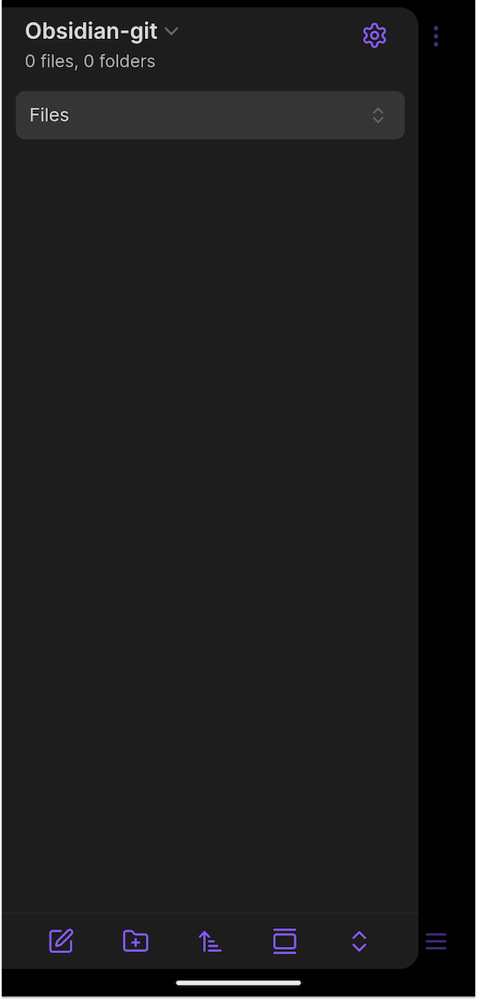
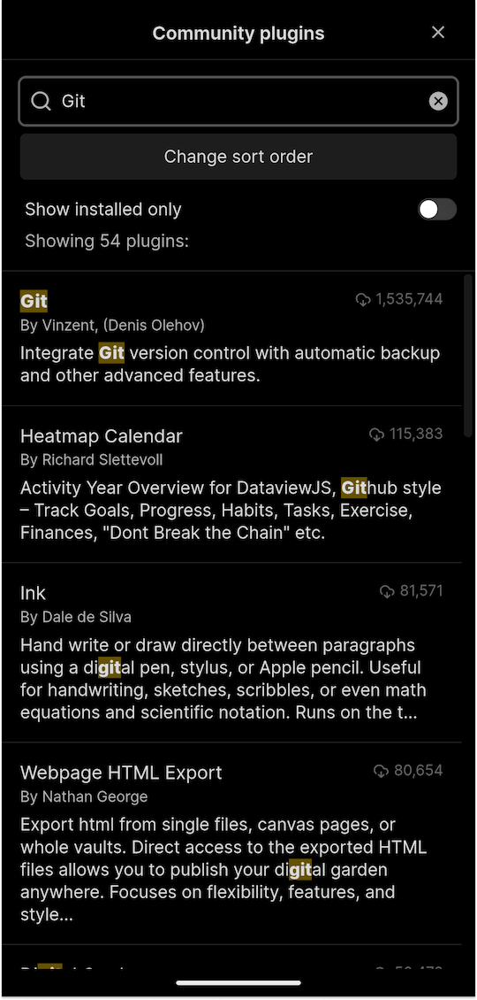
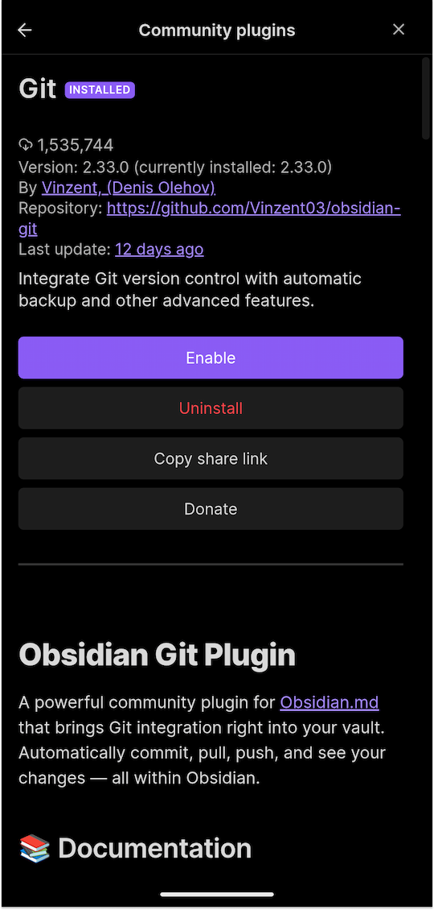
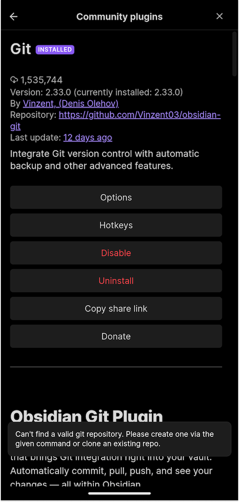
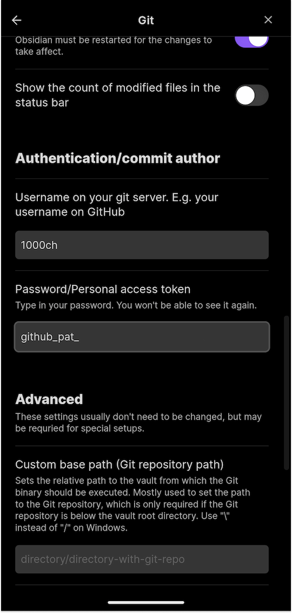
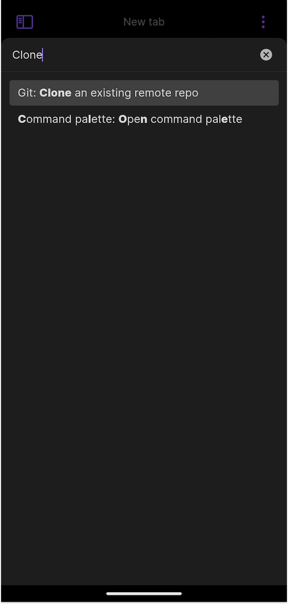
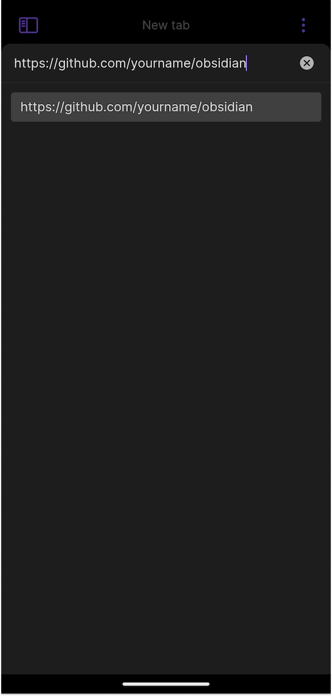

Obsidian のデータ同期をクロスプラットフォームで実現するには、幾つかのアプローチがある。大きく括ると、「公式で提供されている Obsidian Sync という有料の機能を使う」か、「任意の Vault を何らかの方法で端末越しに同期する」である。

自分は後者を幾つか試し、最初は Dropbox で Vault を同期していた。iOS や Android のモバイル端末ではファイルシステムの操作が制限されているが、Android であれば DropSync というアプリを使うことで、Android の任意のフォルダを Dropbox の同期対象として指定できる。これで、Android の Obsidian アプリで Vault を参照するときに任意のフォルダを作成・指定し、DropSync でそのフォルダを同期対象として指定する。あとは、PC の Obsidian でも Dropbox で同期されている Vault を参照すれば期待通りに動作する。

どのように同期されているかのイメージしやすいし、セットアップしてしまえば自動で運用されるが、Dropbox の無料プランで同期対象の端末数に制限があったり、クラウド同期系のアプリのインストール制限がある場合に問題が出てくる。

そこで、Obsidian のプラグインである [obsidian-git](https://github.com/Vinzent03/obsidian-git) を使った同期を紹介する。端末のファイルシステムを、Dropbox ではなく「リモートリポジトリを経由して git で同期する」というアプローチである。新たにセットアップする場合もそうでない場合も、Vault の取り扱いさえ注意すれば問題なく移行できる。移行する場合は Vault をバックアップしてから望むことをオススメする。

## 1. 同期する git リポジトリを作成する

この git リポジトリを元に、各端末が git pull/push することで同期を実現できる。私は GitHub を日常的に使っているので GitHub でリポジトリを作成した。

ここでは `https://github.com/yourname/obsidian` とする。

## 2. 作成した git リポジトリをデスクトップ端末でクローンし、`.gitignore` を追加する

PC の任意の場所に、作成した git リポジトリをクローンする。

```sh
git clone git@github.com: your name/obsidian.git
```

そして、以下の `.gitignore` を追加してリモートに git push する。Obsidian はプラグインを含む設定を `.obsidian` フォルダ配下に作るため、同期する必要がないファイルを指定している。 `workspace.json` や `workspace-mobile.json` はプラグインの有効化状態などが保持されているが、端末に依って事情が異なることがあるため管理対象から除外している。

```
.obsidian/workspace.json
.obsidian/workspace-mobile.json
.obsidian/plugins/obsidian-git/data.json
.obsidian/appearance.json
```

## 3. デスクトップ端末の Obsidian で obsidian-git をセットアップする

コミュニティプラグインから obsidian-git を検索しインストールする。インストールできたらプラグインを有効化し、obsidian-git の設定で、git のコミットに用いられるユーザー名とメールアドレスを入力する。ここまで完了すると、自動で同期が始まる。

`.gitignore` しか同期されていないので、既にコンテンツがある場合は既存の Vault の内容をコピーする。新しくセットアップしている場合は不要な想定だが、プラグインの設定も `.obsidian` フォルダに含まれるため、JSON ファイルが作成されているかもしれない。

## 4. モバイル端末の Obsidian で obsidian-git をセットアップする

先の通り、モバイル環境ではファイルシステムやターミナルに制限があるので工夫が必要になる。ここでは Android 端末を想定した説明になる。

モバイルの Obsidian アプリをインストールし起動すると、Vault を選択するよう要求される。ここで Obsidian Sync ではなく Create new vault で、アプリではない quota でファイルを管理するために Device Storage を選択し、任意の Vault name を入力してフォルダの作成先のディレクトリを指定する。どこでも良いはずだが、Vault name を `Obsidian-git` とし、Internal Storage の `/Documents` 配下に作成した。





これで、モバイル端末が「作成した `/Documents/Obsidian-git` が Vault として認識されているが、リモートの git リポジトリとは同期されていない状態」になった。次に、モバイル端末の Obsidian に [obsidian-git](https://github.com/Vinzent03/obsidian-git) をインストールする。Settings から Community plugins を選択し、"Git" で検索すると obsidian-git が見つかるので、インストールして有効化する。






## 5. 作成した git リポジトリをモバイル端末でクローンする

いよいよ GitHub で作成した `https://github.com/yourname/obsidian` をモバイルの Obsidian でクローンする。

obsidian-git で GitHub のリモートリポジトリとやりとりするためには、Personal Access Token が必要である。PAT の作成は、[GitHub の Fine-grained personal access tokens](https://github.com/settings/personal-access-tokens) から可能で、Token name (例えば "PAT for Obsidian mobile" 等) と Expiration、Repository でトークンがアクセス可能なリポジトリと、Permissions で認める権限を指定する。アクセス可能なリポジトリは **Only select repositories で `yourname/obsidian` を選択** し、**権限は Repository permissions の Contents のみを Read and Write** とするのが良い。作成した PAT を、先程の obsidian-git の Options でユーザー名と一緒に入力する。





ユーザー名と PAT を入力すれば、リモートリポジトリと疎通できるようになるので、 **コマンドパレットから Git: Clone an existing remote repo** を選択し、 `https://github.com/yourname/obsidian` を入力する。あとは「クローン先として作成した Vault を選択」し、「リモートリポジトリに `.obsidian` が既にある」を選べばクローンされる。
