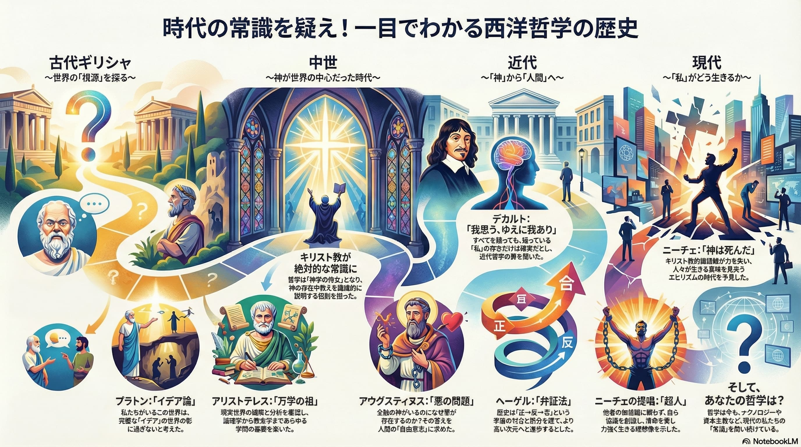

哲学はソクラテスが説いた「[無知の知](https://ja.wikipedia.org/wiki/%E7%84%A1%E7%9F%A5%E3%81%AE%E7%9F%A5)」から始まり、中世のキリスト教神学、近代の理性の時代、そして現代の実存主義まで、主要な思想家の歩みを辿る。

単なる知識の蓄積ではなく、科学や政治が解決できない「答えのない問い」に立ち向かうための手段である。各時代の哲学者が当時の行き詰まった価値観をどう打破しようとしたのか。テクノロジーや資本主義が支配する現代社会においても、自分らしく生きるために哲学的な思考が必要である。

## 哲学とは

哲学の語源はギリシャ語で philein + sophia の「知を愛する」ことを意味する。それは、各時代における「当たり前の常識」を疑い、世界・社会・幸福・死といった「答えのない問い」に対して、その時代なりの最適解を導き出そうとする根源的な営みである。

## 1. 古代ギリシャ: 真理の追求

科学や政治の根源として哲学が誕生した。

### ソクラテス (紀元前5世紀頃)

知恵者とされた人々との対話を通じて、自分が何も知らないことを自覚する **「無知の知」** を提唱した。相手の矛盾を突く[問答法](https://ja.wikipedia.org/wiki/%E5%95%8F%E7%AD%94%E6%B3%95)を用い、知識を詰め込むのではなく、自ら真理を発見させることを重視した。「単に生きるのではなく、善く生きる」意志を貫き、死刑宣告を受けても逃亡せず毒杯を仰いだ。

<affiliate-link
  src="https://m.media-amazon.com/images/I/81iRaHp7b+L._SL1500_.jpg"
  href="https://www.amazon.co.jp/dp/B00QT9X9N6"
  tag="1000ch-22"
  title="ソクラテスの弁明 クリトン (岩波文庫)">
自己の所信を力強く表明する法廷のソクラテスを描いた『ソクラテスの弁明』．死刑の宣告を受けた後，国法を守って平静に死を迎えようとするソクラテスと，脱獄を勧める老友クリトンとの獄中の対話『クリトン』．ともにプラトン初期の作であるが，芸術的にも完璧に近い筆致をもって師ソクラテスの偉大な姿を我々に伝えている．
</affiliate-link>

### プラトン (紀元前427-347年, ソクラテスの弟子)

世の中には様々な形や色のコップがあるが、私たちはそれらを見て共通して「これはコップだ」と判断できる。それは、私たちの頭の中に、個別のコップを超えた「コップらしきもの」という共通のイメージがあるからだ。この **個別の物事の背後にある抽象的な概念そのもの** を、プラトンは「[イデア](https://ja.wikipedia.org/wiki/%E3%82%A4%E3%83%87%E3%82%A2)」と呼んだ。

「善いこと」や「美しいこと」にも、人によって捉え方に違いがある。これらのイデアを追求することで、人間が共通して持つ真理に近づけると考えた。

<affiliate-link
  src="https://m.media-amazon.com/images/I/813qWIBbf4L._SL1500_.jpg"
  href="https://www.amazon.co.jp/dp/B075CNL6F8"
  tag="1000ch-22"
  title="国家 上 (岩波文庫)">
ソクラテスは国家の名において処刑された．それを契機としてプラトンは，師が説きつづけた正義の徳の実現には人間の魂の在り方だけでなく，国家そのものを原理的に問わねばならぬと考えるに至る．この課題の追求の末に提示されるのが，本書の中心テーゼをなすあの哲人統治の思想に他ならなかった．プラトン対話篇中の最高峰．
</affiliate-link>

<affiliate-link
  src="https://m.media-amazon.com/images/I/81aP54fC2sL._SL1500_.jpg"
  href="https://www.amazon.co.jp/dp/B075CPY7SP"
  tag="1000ch-22"
  title="国家 下 (岩波文庫)">
ソクラテスは国家の名において処刑された．それを契機としてプラトンは，師が説きつづけた正義の徳の実現には人間の魂の在り方だけでなく，国家そのものを原理的に問わねばならぬと考えるに至る．この課題の追求の末に提示されるのが，本書の中心テーゼをなすあの哲人統治の思想に他ならなかった．プラトン対話篇中の最高峰．
</affiliate-link>

### アリストテレス (紀元前427-347年, プラトンの弟子)

プラトンの[アカデメイア](https://ja.wikipedia.org/wiki/%E3%82%A2%E3%82%AB%E3%83%87%E3%83%A1%E3%82%A4%E3%82%A2)で学び、科学・物理学・政治・自然・道徳など、極めて多岐にわたる分野を網羅的に研究したことで「万学の祖」と呼ばれ、イデアのような抽象概念よりも、現実の観察やバランス(中庸)を重視した。

彼の自然学や論理学は、中世に至るまで数千年にわたり絶対的な権威として君臨した。例えば物体の自由落下速度は、ガリレオ・ガリレイに否定されるまで信じられ続けた。

<affiliate-link
  src="https://m.media-amazon.com/images/I/8179UjriF6L._SL1500_.jpg"
  href="https://www.amazon.co.jp/dp/B07JYNGLNF"
  tag="1000ch-22"
  title="アリストテレス 弁論術 (岩波文庫)">
古代民主制国家の下で発展したギリシア弁論術の精華．著者は弁論術を，あらゆる場合にその問題に見合った説得手段を見つけ出す能力――と定義，師プラトンが経験による〈慣れ〉にすぎないとした従来の弁論術も，その成功の原因を観察し，方法化することによって〈技術〉として成立させ得ると主張する．明解で読みやすい新訳．
</affiliate-link>

## 2. 中世: キリスト教の補完

キリスト教がヨーロッパを支配したこの時代、哲学は信仰を補完する役割を担った。

### アウグスティヌス (354-430年)

キリスト教の教理に[新プラトン主義](https://ja.wikipedia.org/wiki/%E6%96%B0%E3%83%97%E3%83%A9%E3%83%88%E3%83%B3%E4%B8%BB%E7%BE%A9)を統合した。全知全能の神がいるのになぜ悪が存在するのかという「悪の問題」に対し、神は人間に自由意志を与えたが、人間がその選択を誤ることで悪が生じると説明した。彼の思想は「神の国」と「地の国」を分ける歴史観を提示し、後世に多大な影響を与えた。

<affiliate-link
  src="https://m.media-amazon.com/images/I/515nG58k0mL.jpg"
  href="https://www.amazon.co.jp/dp/B00LBBQQ5K"
  tag="1000ch-22"
  title="告白（上）">
著者はキリスト教神学の集大成をなしとげた初期キリスト教会の教父。「神を賛美する」とも題されるこの書は、みずからがたどったキリスト教信仰への道のりを、隠すことなく率直に述べた稀有な自叙伝。幼年時代に学業をさぼったこと、青年期の女への執着と放縦な生活との葛藤、キケロの著作によって目をひらかれ、アンブロシウスの説教に心を動かされ、キリスト教に目覚めてマニ教から足を洗ったこと をつぶさに記し、最後には永遠の休息を神に希求して神への賛美を高らかにうたう。
</affiliate-link>

<affiliate-link
  src="https://m.media-amazon.com/images/I/51Rjv8CefKL.jpg"
  href="https://www.amazon.co.jp/dp/B00LBBQQFK"
  tag="1000ch-22"
  title="告白（下）">
著者はキリスト教神学の集大成をなしとげた初期キリスト教会の教父。「神を賛美する」とも題されるこの書は、みずからがたどったキリスト教信仰への道のりを、隠すことなく率直に述べた稀有な自叙伝。幼年時代に学業をさぼったこと、青年期の女への執着と放縦な生活との葛藤、キケロの著作によって目をひらかれ、アンブロシウスの説教に心を動かされ、キリスト教に目覚めてマニ教から足を洗ったこと をつぶさに記し、最後には永遠の休息を神に希求して神への賛美を高らかにうたう。
</affiliate-link>

## 3. 近代: 神から「理性」へ

宗教の影響力が弱まり、科学の発達と共に、神ではなく人間の能力(理性)を信じる時代へ移行した。

### ルネ・デカルト (1596-1650年)

数学者でもあったデカルトは、世の中の不確かなものをすべて排除しようと試み、「目に見えるものは幻覚かもしれない」「今生きているこの世界自体が夢かもしれない」と、疑える余地のあるものを一つずつ消去していった。すべてを疑った末に、疑っている自分自身の存在だけは確実であるという「[我思う、ゆえに我あり](https://ja.wikipedia.org/wiki/%E6%88%91%E6%80%9D%E3%81%86%E3%80%81%E3%82%86%E3%81%88%E3%81%AB%E6%88%91%E3%81%82%E3%82%8A)」に到達した。数学的・分析的な手法を哲学に持ち込み、精神と身体を厳格に区別する[二元論](https://ja.wikipedia.org/wiki/%E4%BA%8C%E5%85%83%E8%AB%96)を唱えたことで、「近代哲学の父」と呼ばれる。

<affiliate-link
  src="https://m.media-amazon.com/images/I/81ogISSK-mL._SL1500_.jpg"
  href="https://www.amazon.co.jp/dp/B00QT9X9ZY"
  tag="1000ch-22"
  title="方法序説 (岩波文庫)">
すべての人が真理を見いだすための方法を求めて，思索を重ねたデカルト（1596－1650）．「われ思う，ゆえにわれあり」は，その彼がいっさいの外的権威を否定して達した，思想の独立宣言である．本書で示される新しい哲学の根本原理と方法，自然の探求の展望などは，近代の礎を築くものとしてわたしたちの学問の基本的な枠組みをなしている．［新訳］
</affiliate-link>

### イマヌエル・カント (1724-1804年)

人間の認識能力の限界を確定しようと試みた。道徳においては、損得勘定ではなく自らの理性が命じる道徳法則に従うことこそが「自由」であると説いた。その際「汝の意志の格律が、常に普遍的な立法の原理として妥当するように行動せよ」という「[定言命法](https://ja.wikipedia.org/wiki/%E5%AE%9A%E8%A8%80%E5%91%BD%E6%B3%95)」を掲げ、人間の尊厳を強調した。

<affiliate-link
  src="https://m.media-amazon.com/images/I/81ix8WsvfOL._SL1500_.jpg"
  href="https://www.amazon.co.jp/dp/B00RF1QFAG"
  tag="1000ch-22"
  title="永遠平和のために (岩波文庫)">
世界の恒久的平和はいかにしてもたらされるべきか．カントは，常備軍の全廃・諸国家の民主化・国際連合の創設など具体的提起を行ない，さらに人類の最高善＝永遠平和の実現が決して空論にとどまらぬ根拠を明らかにして，人間ひとりひとりに平和への努力を厳粛に義務づける．あらためて熟読されるべき平和論の古典．
</affiliate-link>

### ヘーゲル (1770-1831年)

物事は矛盾や対立(正・反)を抱えながら、それを乗り越えてより高い次元へと発展(合・止揚)するという「[弁証法](https://ja.wikipedia.org/wiki/%E5%BC%81%E8%A8%BC%E6%B3%95)」を大成させた。歴史を、精神が自己実現を図りながら「自由」を拡大していくプロセスと捉え、個人を超えた社会や国家といった全体的な枠組みの中で真理を追求した。

<affiliate-link
  src="https://m.media-amazon.com/images/I/71OYCNyeH1L._SL1500_.jpg"
  href="https://www.amazon.co.jp/dp/B07QKXCQVQ"
  tag="1000ch-22"
  title="精神現象学　上 (ちくま学芸文庫)">
感覚的経験という最も身近な段階から、数知れぬ弁証法的過程を経て、最高次の「絶対知」へと至るまで──。精神のこの遍歴を壮大なスケールで描き出し、哲学史上、この上なく難解かつ極めて重要な書物として、不動の地位を築いてきた『精神現象学』。我が国でも数多くの翻訳がなされてきたが、本書は、流麗ながら、かつてない平明な訳文により、ヘーゲルの晦渋な世界へと読者をやさしく誘う。同時に、主要な版すべてを照合しつつ訳出された本書は、それら四つの原典との頁対応も示し、原文を参照する一助となす。今後のヘーゲル読解に必携の画期的翻訳、文庫オリジナルでついに刊行。【※本電子書籍版には、紙書籍版本文の上欄、下欄に付した４つの原典（グロックナー版全集第二巻、ホフマイスター版、ズールカンプ版全集第三巻および大全集版〔アカデミー版〕）とのページ対応は含まれません。】
</affiliate-link>

<affiliate-link
  src="https://m.media-amazon.com/images/I/71vgMUJn1hL._SL1500_.jpg"
  href="https://www.amazon.co.jp/dp/B07QKWRDLX"
  tag="1000ch-22"
  title="精神現象学　下 (ちくま学芸文庫)">
長大な遍歴のすえ、人間はいかにして「絶対知」へと到達するのか？　この書により、哲学史上、かつてない壮大な哲学体系をつくりあげたヘーゲルが、最後に出した答えとは──。平明な語り口でありながら、今後のヘーゲル研究に絶大な影響を与えるであろう緻密な新訳が、その核心を明らかにする。下巻の巻末には、『精神現象学』に数多くちりばめられた、広く知られる名言を拾いあげた「フレーズ索引」を収録。従来のはるか先へと読者の理解を導く。「精神が偉大なものとなるのは、より大きな対立からみずからへと立ちかえる場合である」。【※本電子書籍版には、紙書籍版本文の上欄、下欄に付した４つの原典（グロックナー版全集第二巻、ホフマイスター版、ズールカンプ版全集第三巻および大全集版〔アカデミー版〕）とのページ対応は含まれません。】
</affiliate-link>

## 4. 近現代: 個人の幸福と社会

国家や宗教という大きな枠組みから、「自分にとっての幸せ」や「人間らしさ」が問われるようになった。

### セーレン・キェルケゴール (1813-1855年)

ヘーゲル的な抽象論に反対し、「私にとっての心理」を求める[実存主義](https://ja.wikipedia.org/wiki/%E5%AE%9F%E5%AD%98%E4%B8%BB%E7%BE%A9)の先駆けとなった。自分を客観的に見失うことを「絶望」と呼び、これを「[死に至る病](https://ja.wikipedia.org/wiki/%E6%AD%BB%E3%81%AB%E8%87%B3%E3%82%8B%E7%97%85)」と定義した。絶望から救われるには、社会の常識ではなく、単独者として神(絶対者)に向き合うしかないと説いた。

<affiliate-link
  src="https://m.media-amazon.com/images/I/81sog4-dfhL._SL1500_.jpg"
  href="https://www.amazon.co.jp/dp/B06Y5KTJG6"
  tag="1000ch-22"
  title="死に至る病 (講談社学術文庫)">
「死に至る病とは絶望のことである」。──この鮮烈な主張を打ち出した本書は、キェルケゴールの後期著作活動の集大成として燦然と輝いている。本書は、気鋭の研究者が最新の校訂版全集に基づいてデンマーク語原典から訳出するとともに、簡にして要を得た訳注を加えた、新時代の決定版と呼ぶにふさわしい新訳である。「死に至る病」としての「絶望」が「罪」に変質するさまを見据え、その治癒を目的にして書かれた教えと救いの書。
</affiliate-link>

### フリードリヒ・ニーチェ (1844-1900年)

既存のキリスト教的道徳を「弱者の恨み([ルサンチマン](https://ja.wikipedia.org/wiki/%E3%83%AB%E3%82%B5%E3%83%B3%E3%83%81%E3%83%9E%E3%83%B3))」として批判し、「神は死んだ」と宣言した。絶対的な価値観が崩壊したニヒリズムの時代において、運命を愛し、自ら新しい価値を創造し続ける「超人」として生きるべきだと主張した。

<affiliate-link
  src="https://m.media-amazon.com/images/I/81JH07LHk+L._SL1500_.jpg"
  href="https://www.amazon.co.jp/dp/B00QT9XB16"
  tag="1000ch-22"
  title="ツァラトゥストラは　こう言った 上 (岩波文庫)">
晩年のニーチェ（一八四四―一九〇〇）がその根本思想を体系的に展開した第一歩というべき著作．有名な「神は死んだ」という言葉で表わされたニヒリズムの確認からはじめて，さらにニーチェは，神による価値づけ・目的づけを剥ぎとられた在るがままの人間存在はその意味を何によって見出すべきかと問い，それに答えようとする．
</affiliate-link>

<affiliate-link
  src="https://m.media-amazon.com/images/I/81cw-KM3htL._SL1500_.jpg"
  href="https://www.amazon.co.jp/dp/B00QT9XAT4"
  tag="1000ch-22"
  title="ツァラトゥストラは　こう言った 下 (岩波文庫)">
晩年のニーチェ（一八四四―一九〇〇）がその根本思想を体系的に展開した第一歩というべき著作．有名な「神は死んだ」という言葉で表わされたニヒリズムの確認からはじめて，さらにニーチェは，神による価値づけ・目的づけを剥ぎとられた在るがままの人間存在はその意味を何によって見出すべきかと問い，それに答えようとする．
</affiliate-link>

### ハンナ・アーレント (1906-1975年)

ナチスによるホロコーストを経験し、全体主義の恐ろしさを分析した。悪とは特別な人間が行うものではなく、思考を停止した凡庸な人間が生み出すものだとする「悪の陳腐さ」を指摘した。人間らしさを取り戻すには、単なる労働ではなく、他者と対話し公共の場に参加する「活動」が必要だと説いた。

<affiliate-link
  src="https://m.media-amazon.com/images/I/71QPuVJJ7NL._SL1500_.jpg"
  href="https://www.amazon.co.jp/dp/B09FP4VHKX"
  tag="1000ch-22"
  title="人間の条件 (ちくま学芸文庫)">
条件づけられた人間が環境に働きかける内発的な能力、すなわち「人間の条件」の最も基本的要素となる活動力は、《労働》《仕事》《活動》の三側面から考察することができよう。ところが《労働》の優位のもと、《仕事》《活動》が人間的意味を失った近代以降、現代世界の危機が用意されることになったのである。こうした「人間の条件」の変貌は、遠くギリシアのポリスに源を発する「公的領域」の喪失と、国民国家の規模にまで肥大化した「私的領域」の支配をもたらすだろう。本書は、全体主義の現実的基盤となった大衆社会の思想的系譜を明らかにしようした、アレントの主著のひとつである。
</affiliate-link>
